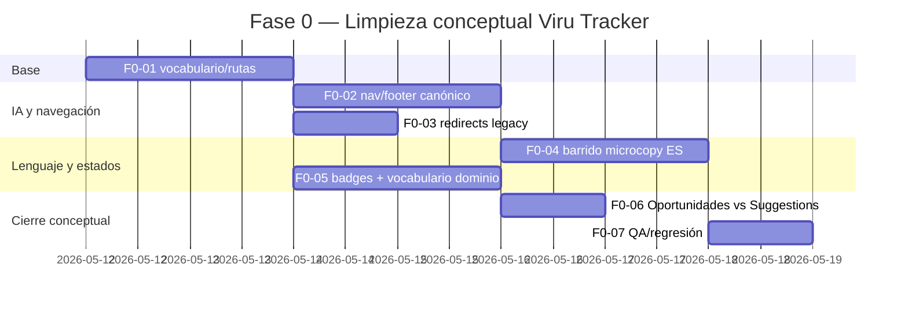

# Plan de desarrollo Fase 0 para Viru Tracker

## Resumen ejecutivo

**Conectores usados al inicio:** urlGitHubhttps://github.com

Fase 0 no debe añadir features nuevas ni backend pesado. Debe dejar a Viru con un **lenguaje único**, una **IA de navegación clara**, una **semántica de estados consistente** y una **traducción limpia entre producto, ruta, API y entidad**. El repo ya tiene rutas canónicas y contrato visual, pero la UI todavía mezcla inglés, mantiene conceptos duplicados (`/recomendaciones` vs `/suggestions`) y usa estados dispersos en frontend/backend. fileciteturn11file0L1-L1 fileciteturn26file0L1-L1 fileciteturn27file0L1-L1 fileciteturn53file0L1-L1 fileciteturn54file0L1-L1

La salida recomendada de Fase 0 es esta: **Quick Search** sigue siendo el motor de búsqueda/descubrimiento, **Watchlist** sigue siendo el centro operativo con histórico integrado, **Alertas** sigue siendo el motor de vigilancia, **Oportunidades** pasa a ser la etiqueta visible para `/recomendaciones`, y **Suggestions** deja de vivir como módulo core del workspace. fileciteturn23file0L1-L1 fileciteturn45file0L1-L1 fileciteturn25file0L1-L1 fileciteturn58file0L1-L1

## Inventario de repo/docs leídos y usados

| Path | Qué extraje | Uso en Fase 0 |
|---|---|---|
| `docs/INDICE_UNICO.md` | Mapa de documentación viva, áreas y fuentes de verdad por rol/área. fileciteturn7file0L1-L1 | Punto de arranque documental. |
| `docs/overview/project-overview.md` | Propósito actual de Viru, stack visible y foco en watchlists, histórico, alertas y quick search. fileciteturn8file0L1-L1 | Define el marco conceptual correcto. |
| `docs/overview/current-state.md` | Rutas públicas/privadas actuales, stack, y estructura de `frontend/src` y `backend/app`. fileciteturn11file0L1-L1 | Base para ruta canónica, alias y backlog técnico. |
| `docs/overview/repo-map.md` | Distribución real del repo y jerarquía de carpetas activas. fileciteturn12file0L1-L1 | Sirve para proponer paths exactos de trabajo. |
| `docs/overview/architecture-summary.md` | Monorepo backend/frontend/infra/docs y límites de la fuente técnica consolidada. fileciteturn13file0L1-L1 | Justifica marcar incertidumbres como `VALIDAR EN REPO`. |
| `docs/product/dashboard.md` + `docs/specs/product/dashboard-redesign-v2.md` | Dashboard como área de jerarquía/foco; fusión explícita de Recomendaciones + Sugerencias en “Oportunidades”. fileciteturn14file0L1-L1 fileciteturn25file0L1-L1 | Evidencia central para quitar duplicidad conceptual. |
| `docs/product/quick-search.md` + `docs/reference/backend/quick-search-contract.md` + `docs/reference/backend/quick-search-acceptance-checklist.md` | Quick Search tiene el contrato más sólido del producto y semántica canónica propia. fileciteturn15file0L1-L1 fileciteturn23file0L1-L1 fileciteturn24file0L1-L1 | Impide contaminar Quick Search con naming o IA de consola. |
| `docs/product/watchlist.md` | Watchlist es core, pero sin doc funcional consolidada viva. fileciteturn16file0L1-L1 | Justifica crear un mapa producto↔ruta↔API↔entidad. |
| `docs/runbooks/runbook-watchlist-uniqueness-migration.md` | Definición operativa exacta de unicidad de watch por `user_id + origin + destination + travel_date_local`. fileciteturn21file0L1-L1 | Sirve para fijar vocabulario y evitar reintroducir ambigüedad. |
| `docs/runbooks/runbook-db-retention.md` | Tablas operativas de crecimiento, incluida `price_snapshot` y `notification_event`. fileciteturn22file0L1-L1 | Confirma qué entidades son reales y persistidas. |
| `docs/ui/UI_CONTRACT_V1.md` + `docs/ui/UI_SYSTEM_V1.md` | Glosario UI, rutas canónicas, naming de estados y prohibición práctica de `warn` como naming activo. fileciteturn26file0L1-L1 fileciteturn27file0L1-L1 | Base normativa para badge catalog y limpieza de copy/IA. |
| `backend/app/infrastructure/db/models.py` | Modelos reales: `FlightWatch`, `PriceSnapshot`, `AlertRule`, `NotificationEvent`, `UxEvent`, `UserPreference`, `UserPreferenceAppearance`, `UserPreferenceRegion`. fileciteturn30file0L1-L1 | Traducción exacta entidad↔producto. |
| `backend/app/api/v1/router.py` | Prefijos reales de API: `/watchlist`, `/alerts`, `/search`, `/preferences`, `/recommendations`, `/suggestions`, etc. fileciteturn75file0L1-L1 | Mapa de contratos y dependencias. |
| `backend/app/api/v1/watchlist.py` | Reglas de watchlist reales: create/list/update/delete y `refresh-now`; estados `active|paused|deleted`. fileciteturn37file0L1-L1 | Base para vocabulario de estados. |
| `backend/app/api/v1/alerts.py` + `backend/app/services/alert_service.py` | Reglas, evaluación, cooldown, eventos, delivery status y mensajes de trigger. fileciteturn41file0L1-L1 fileciteturn42file0L1-L1 | Base para catálogo de badges/estados. |
| `backend/app/api/v1/preferences.py` | Endpoints reales de búsqueda, apariencia y región. fileciteturn76file0L1-L1 | Permite mapear `/preferencias/*` con `/api/v1/preferences/*`. |
| `backend/app/api/v1/admin.py` | `system.status` como dato derivado (`ok|degraded|critical`), no como tabla propia. fileciteturn35file0L1-L1 | Evidencia para marcar `system_status` persistido como `UNSPECIFIED`. |
| `backend/app/domain/schemas.py` | Validaciones y aliases reales: `threshold_below`→`threshold_low`, `threshold_above`→`threshold_high`, tipos de feedback `bug|idea|general`. fileciteturn43file0L1-L1 | Permite proponer redirect de `/suggestions` hacia feedback de idea, con `VALIDAR EN REPO`. |
| `frontend/src/app/(private)/dashboard/page.tsx` | Hero “Hoy en Viru”, CTA, card de oportunidades, pero FTUE con copy visible en inglés. fileciteturn44file0L1-L1 | Evidencia para barrido de microcopy. |
| `frontend/src/app/(private)/watchlist/page.tsx` | Watchlist usa histórico integrado, “Mesa de decisiones”, comparativa y still visible English strings: `Back`, `Flight Watchlist`, `Add flight`, `Quick start`, `Last update`. fileciteturn45file0L1-L1 | Evidencia central de Fase 0. |
| `frontend/src/app/(private)/alerts/page.tsx` | UI de alertas con presets, cooldown, simulación, historial y mapeo local de delivery status. fileciteturn46file0L1-L1 | Evidencia para centralizar badges y labels. |
| `frontend/src/modules/quick-search/QuickSearchView.tsx` | Quick Search es una vista compleja con copy propia, seeds, preferencias, loader y workspace. fileciteturn49file0L1-L1 | Impone prudencia: Fase 0 no debe reabrir todo Quick Search. |
| `frontend/src/modules/shared/navigationV1.ts` + `PrivateNav.tsx` + `ViruFooterBlock.tsx` | IA actual de navegación y footer; aparece `/suggestions` como módulo privado y `/recomendaciones` como otro módulo distinto. fileciteturn53file0L1-L1 fileciteturn52file0L1-L1 fileciteturn54file0L1-L1 | Prueba exacta de duplicidad conceptual y de dónde arreglarla. |
| `frontend/src/app/(private)/history/page.tsx` + `frontend/src/app/(private)/preferences/page.tsx` | Alias legacy con redirect client-side y copy visible aún mezclado. fileciteturn61file0L1-L1 fileciteturn62file0L1-L1 | Base para canonical redirects limpios. |
| `frontend/src/modules/recommendations/RecommendationsExplorer.tsx` + `frontend/src/app/(private)/suggestions/page.tsx` | `/recomendaciones` ya es una pantalla potente; `/suggestions` es feedback/product suggestion, no discovery core. fileciteturn63file0L1-L1 fileciteturn58file0L1-L1 | Justifica separar “Oportunidades” de “Feedback”. |

### Archivos solicitados por el usuario y no localizados dentro del repo GitHub

| Archivo solicitado | Estado en repo | Nota |
|---|---|---|
| `project-overview.md` | **FOUND** | Existe como `docs/overview/project-overview.md`. |
| `landing-page.pdf`, `login.pdf`, `dashboard.pdf`, `watchlist.pdf`, `alerts.pdf`, `vuelos-quick-search.pdf`, `ajustes-quick-search.pdf`, `quick-search sin vuelo.pdf`, `recomendaciones.pdf`, `preferencias.pdf`, `preferencias-busqueda.pdf`, `preferencias-apariencia.pdf`, `idioma-region.pdf`, `ayuda.pdf` | **MISSING en repo** | Disponibles como archivos subidos fuera del repo, no como fuentes versionadas en GitHub durante esta revisión. |
| `Aplicación selectiva de Skyport a Viru Tracker.docx` | **MISSING en repo** | Disponible como archivo subido fuera del repo. |
| `Auditoría estratégica de Skyport para Viru Tracker.docx` | **MISSING en repo** | Disponible como archivo subido fuera del repo. |

## Hallazgos base que obligan a Fase 0

El repo ya define rutas canónicas de UI (`/dashboard`, `/watchlist`, `/quick-search`, `/alerts`, `/preferencias`) y alias legacy (`/history`, `/preferences`), pero todavía conviven señales de deriva: copy visible en inglés, alias con pantalla intermedia, y duplicidad entre `/recomendaciones` y `/suggestions`. Eso no es un problema de features; es un problema de **modelo mental roto**. fileciteturn26file0L1-L1 fileciteturn27file0L1-L1 fileciteturn53file0L1-L1 fileciteturn61file0L1-L1 fileciteturn62file0L1-L1

Watchlist es claramente el centro operativo real, con histórico integrado, comparativa y “Mesa de decisiones”, pero el naming visible todavía no lo refleja de forma consistente. Además, la propia doc viva de watchlist admite que no tiene una fuente consolidada de verdad. Por tanto, antes de construir nada nuevo hay que congelar el léxico y el mapa entidad↔módulo. fileciteturn45file0L1-L1 fileciteturn16file0L1-L1 fileciteturn21file0L1-L1

También hay una deriva de estados y badges. El contrato UI exige `success|warning|error|info` y desaconseja reintroducir `warn`, mientras el frontend mantiene mapeos locales y estilos ad hoc como `status-ok`, delivery labels manuales y múltiples nomenclaturas para estados equivalentes. Esto es deuda de lenguaje, no una mejora cosmética. fileciteturn26file0L1-L1 fileciteturn27file0L1-L1 fileciteturn44file0L1-L1 fileciteturn46file0L1-L1

Finalmente, el propio spec de dashboard ya decidió algo que Fase 0 debe extender al resto del producto: **fusionar Recomendaciones + Sugerencias en “Oportunidades”** y eliminar duplicidad conceptual. Hoy esa decisión existe en spec, pero no está aplicada de manera uniforme en navegación/footer/rutas legacy. fileciteturn25file0L1-L1 fileciteturn53file0L1-L1 fileciteturn54file0L1-L1 fileciteturn58file0L1-L1

## Mapa de renombres y catálogo de badges

### Rename map recomendado

| Viejo | Nuevo canónico | Alcance | Estado |
|---|---|---|---|
| `Recomendaciones` como módulo visible de workspace | **Oportunidades** | labels visibles, nav, footer, dashboard | Aplicar |
| `Suggestions` / `Sugerencias` como módulo privado de workspace | **Feedback de producto** o ruta legacy oculta | mover a soporte; no core workspace | Aplicar con `VALIDAR EN REPO` |
| `History` | **Watchlist** con histórico integrado | alias legacy `/history` | Aplicar |
| `Flight Watchlist` | **Watchlist** | título de pantalla | Aplicar |
| `Back` | **Volver** | botones privados | Aplicar |
| `Add flight` | **Añadir vuelo** | watchlist | Aplicar |
| `Quick start` | **Primeros pasos** | FTUE | Aplicar |
| `Got it` | **Entendido** | FTUE | Aplicar |
| `Last update:` | **Última actualización:** | watchlist | Aplicar |
| `warn` | **warning** | clases/semántica interna | Aplicar |

Base real de estos cambios: spec de dashboard, glosario UI, rutas canónicas y copy visible en páginas privadas. fileciteturn25file0L1-L1 fileciteturn26file0L1-L1 fileciteturn27file0L1-L1 fileciteturn44file0L1-L1 fileciteturn45file0L1-L1 fileciteturn61file0L1-L1

### Badge/status catalog recomendado

| Dominio | Valor raw | Label visible | Tone |
|---|---|---|---|
| Watch | `active` | Activo | `success` |
| Watch | `paused` | Pausado | `warning` |
| Watch | `deleted` | Eliminado | `info` |
| Alert delivery | `queued` | En espera | `warning` |
| Alert delivery | `sent` / `delivered` | Enviado | `success` |
| Alert delivery | `failed` / `error` | Error | `error` |
| System | `ok` | Operativo | `success` |
| System | `degraded` | Degradado | `warning` |
| System | `critical` | Incidencia | `error` |

Estos values existen hoy dispersos en modelos, admin health y frontend de alertas; la fase correcta es **centralizarlos**, no rediseñarlos. fileciteturn30file0L1-L1 fileciteturn35file0L1-L1 fileciteturn46file0L1-L1

## Backlog ordenado de issues listo para GitHub

### Checklist priorizado

| Orden | Issue | Prioridad | Esfuerzo | Dependencia |
|---|---|---:|---|---|
| 1 | F0-01 Congelar vocabulario, rutas y mapa entidad→UI→API | P1 | M (5 SP) | Ninguna |
| 2 | F0-02 Rehacer navegación privada y footer con IA canónica | P1 | M (5 SP) | F0-01 |
| 3 | F0-03 Convertir alias legacy a redirects limpios de servidor | P1 | S (3 SP) | F0-01 |
| 4 | F0-04 Barrido de microcopy visible en español | P1 | M (5 SP) | F0-02, F0-03 |
| 5 | F0-05 Catálogo único de badges y vocabulario de dominio | P2 | M (5 SP) | F0-01 |
| 6 | F0-06 Desacoplar Oportunidades de Suggestions/feedback | P2 | M (5 SP) | F0-02, F0-04 |
| 7 | F0-07 QA/regresión de limpieza conceptual | P1 | S (3 SP) | Todas |

### F0-01 — `docs/product-language-map: congelar vocabulario, rutas y traducción entidad→UI→API`

**Descripción**  
Crear una fuente única de Fase 0 para lenguaje de producto. Debe traducir: módulo visible, ruta canónica, API real, entidad persistida, alias legacy y ámbito. Hoy no existe un documento que cubra esto de forma estable; watchlist y database lo reconocen indirectamente. fileciteturn16file0L1-L1 fileciteturn20file0L1-L1

**Motivación**  
Sin este mapa, cada equipo seguirá usando nombres distintos: “watchlist item”, “watch”, “history”, “suggestions”, “recommendations”, “system_status”. El repo real usa `FlightWatch`, `PriceSnapshot`, `AlertRule`, `NotificationEvent`, `UxEvent` y `UserPreference*`; algunos nombres pedidos por auditoría no existen literalmente como modelo persistido y deben marcarse. fileciteturn30file0L1-L1 fileciteturn35file0L1-L1

**Archivos a tocar**
- `docs/reference/product-language-map.md` **(nuevo)**
- `docs/product/watchlist.md`
- `docs/overview/current-state.md`
- `docs/ui/UI_CONTRACT_V1.md`

**Criterios de aceptación**
- Existe una tabla con columnas: `label visible`, `ruta`, `API`, `entidad`, `alias legacy`, `estado`.
- Se documenta explícitamente:
  - `FlightWatch` = vuelo vigilado / item de watchlist.
  - `PriceSnapshot` = snapshot de precio / histórico.
  - `AlertRule` = regla de alerta.
  - `NotificationEvent` = evento de alerta.
  - `UxEvent` = evento UX/analítica.
- Se marca como **UNSPECIFIED / derivado**:
  - `watchlist_item` como nombre exacto de modelo.
  - `activity_event` como nombre exacto de modelo.
  - `system_status` como tabla persistida.

**Esfuerzo**  
M (5 SP)

**Migración Alembic**  
No aplica.

**Cambios API**  
No aplica.

**Snippet sugerido**
```ts
// frontend/src/modules/shared/productVocabulary.ts
export const PRODUCT_VOCAB = {
  watchlist: { label: "Watchlist", route: "/watchlist", api: "/api/v1/watchlist", entity: "FlightWatch" },
  history: { label: "Histórico", route: "/watchlist", api: "/api/v1/prices", entity: "PriceSnapshot", legacy: "/history" },
  alerts: { label: "Alertas", route: "/alerts", api: "/api/v1/alerts", entity: "AlertRule" },
  opportunities: { label: "Oportunidades", route: "/recomendaciones", api: "/api/v1/recommendations" },
  preferences: { label: "Preferencias", route: "/preferencias", api: "/api/v1/preferences", legacy: "/preferences" },
} as const;
```

**Tests a añadir**
- `frontend/tests/product-vocabulary-map.test.ts`
- Smoke docs check si existe pipeline de docs; si no, revisión manual en checklist QA.

---

### F0-02 — `frontend/navigation: rehacer navegación privada y footer con IA canónica`

**Descripción**  
Unificar `PrivateNav` y `ViruFooterBlock` para que la IA visible del workspace sea coherente con las rutas canónicas y con el spec de dashboard. La navegación privada debe enseñar solo módulos core; el footer no debe duplicar conceptos. fileciteturn52file0L1-L1 fileciteturn53file0L1-L1 fileciteturn54file0L1-L1

**Motivación**  
Hoy la navegación ya apunta a rutas canónicas, pero el footer privado conserva `Suggestions` como workspace item y el producto vive una colisión conceptual entre “Recomendaciones”, “Oportunidades” y “Sugerencias”. El spec ya pidió eliminar esa duplicidad. fileciteturn25file0L1-L1 fileciteturn53file0L1-L1 fileciteturn54file0L1-L1

**Archivos a tocar**
- `frontend/src/modules/shared/navigationV1.ts`
- `frontend/src/modules/shared/PrivateNav.tsx`
- `frontend/src/modules/shared/ViruFooterBlock.tsx`

**Criterios de aceptación**
- `PrivateNav` queda exactamente con:
  - Dashboard
  - Watchlist
  - Quick Search
  - Alertas
  - Oportunidades
  - Preferencias
  - Ayuda
- `Suggestions` desaparece del árbol principal de workspace.
- En footer privado, `Feedback` vive solo en soporte.
- `CANONICAL_ROUTES` mantiene alias legacy, pero no se promocionan visualmente.

**Esfuerzo**  
M (5 SP)

**Migración Alembic**  
No aplica.

**Cambios API**  
No aplica.

**Snippet sugerido**
```ts
// frontend/src/modules/shared/navigationV1.ts
export const NAV_V1_PRIVATE = [
  { href: "/dashboard", labelKey: "shared.footer.links.dashboard" },
  { href: "/watchlist", labelKey: "shared.footer.links.watchlist" },
  { href: "/quick-search", labelKey: "shared.footer.links.quickSearch" },
  { href: "/alerts", labelKey: "shared.footer.links.alerts" },
  { href: "/recomendaciones", labelKey: "shared.footer.links.opportunities" },
  { href: "/preferencias", labelKey: "shared.footer.links.preferences" },
  { href: "/soporte/ayuda", labelKey: "shared.footer.links.help" },
] as const;
```

**Tests a añadir**
- `frontend/tests/navigation-v1.test.ts`
- `frontend/tests/footer-private-groups.test.tsx`

---

### F0-03 — `frontend/redirects: convertir alias legacy a redirects limpios de servidor`

**Descripción**  
Sustituir redirects client-side con pantalla intermedia por redirects de servidor en `/history` y `/preferences`. Si se aprueba F0-06, aplicar la misma estrategia a `/suggestions`. fileciteturn61file0L1-L1 fileciteturn62file0L1-L1

**Motivación**  
Los alias existen para compatibilidad, pero hoy muestran copy visible y, en el caso de `/history`, todavía muestran el término legado al usuario. Fase 0 debe hacerlos invisibles y canónicos. fileciteturn26file0L1-L1 fileciteturn61file0L1-L1 fileciteturn62file0L1-L1

**Archivos a tocar**
- `frontend/src/app/(private)/history/page.tsx`
- `frontend/src/app/(private)/preferences/page.tsx`
- `frontend/src/app/(private)/suggestions/page.tsx` **(solo si F0-06 se aprueba)**

**Criterios de aceptación**
- `/history` hace redirect inmediato a `/watchlist`.
- `/preferences` hace redirect inmediato a `/preferencias`.
- No hay flash de loader/copy innecesario.
- No hay texto visible en inglés durante el redirect.

**Esfuerzo**  
S (3 SP)

**Migración Alembic**  
No aplica.

**Cambios API**  
No aplica.

**Snippet sugerido**
```tsx
// frontend/src/app/(private)/history/page.tsx
import { redirect } from "next/navigation";

export default function HistoryRedirectPage() {
  redirect("/watchlist");
}
```

**Tests a añadir**
- `frontend/tests/legacy-route-redirects.test.tsx`

---

### F0-04 — `frontend/i18n: barrido de microcopy visible en español`

**Descripción**  
Eliminar el inglés residual en rutas privadas y mover copy hardcoded a i18n o, si no existe dominio, crearlo. La prioridad es `/dashboard`, `/watchlist`, `/history` y cualquier redirect/prompt visible durante sesión privada. fileciteturn44file0L1-L1 fileciteturn45file0L1-L1 fileciteturn61file0L1-L1

**Motivación**  
El contrato UI prohíbe mezclar ES/EN en la UI visible. Hoy hay strings directos como `Back`, `Flight Watchlist`, `Add flight`, `Quick start`, `Got it` y `Last update:`. Eso rompe tono editorial y confianza. fileciteturn26file0L1-L1 fileciteturn44file0L1-L1 fileciteturn45file0L1-L1

**Archivos a tocar**
- `frontend/src/app/(private)/dashboard/page.tsx`
- `frontend/src/app/(private)/watchlist/page.tsx`
- `frontend/src/app/(private)/history/page.tsx`
- `frontend/src/i18n/domains/dashboard.ts` **VALIDAR EN REPO**
- `frontend/src/i18n/domains/watchlist.ts` **VALIDAR EN REPO**
- `frontend/src/i18n/domains/shared.ts` **VALIDAR EN REPO**

**Microcopy exacto recomendado**

| Old | New |
|---|---|
| `Back` | `Volver` |
| `Flight Watchlist` | `Watchlist` |
| `Control center to monitor, filter, analyze, and compare without changing screens.` | `Tu mesa para vigilar, comparar y decidir sin salir de la misma vista.` |
| `Add flight` | `Añadir vuelo` |
| `Quick start` | `Primeros pasos` |
| `Save flights here to track their changes.` | `Guarda vuelos aquí para seguir cambios de precio y horario.` |
| `Got it` | `Entendido` |
| `Last update:` | `Última actualización:` |
| `Redirecting to the unified panel` | `Redirigiendo a Watchlist` |
| `History is now part of Flight Watchlist.` | `El histórico ahora vive dentro de Watchlist.` |

**Criterios de aceptación**
- No quedan strings visibles en inglés en sesión privada con locale `es`.
- Todos los textos nuevos pasan por i18n o se extraen a constantes centralizadas.
- Los botones “volver” usan la misma clave compartida.

**Esfuerzo**  
M (5 SP)

**Migración Alembic**  
No aplica.

**Cambios API**  
No aplica.

**Snippet sugerido**
```tsx
<button className="btn-ghost" type="button" onClick={() => router.push("/dashboard")}>
  {t("shared.actions.back")}
</button>
```

**Tests a añadir**
- `frontend/tests/private-visible-copy-es.test.tsx`
- snapshot/smoke de `/dashboard` y `/watchlist`

---

### F0-05 — `frontend+backend: catálogo único de badges y vocabulario de dominio`

**Descripción**  
Crear una pieza única para estados/badges y una capa ligera de constantes/enums de dominio. El objetivo no es cambiar payloads ni migrar DB; es evitar deriva de strings y alinear backend/UI. fileciteturn30file0L1-L1 fileciteturn35file0L1-L1 fileciteturn41file0L1-L1 fileciteturn42file0L1-L1

**Motivación**  
Hoy `FlightWatch.status`, `AlertRule.rule_type`, delivery status y `system.status` viven como strings sueltos en varios puntos. El contrato UI ya define la semántica correcta; solo falta aplicarla de forma sistemática. fileciteturn26file0L1-L1 fileciteturn27file0L1-L1

**Archivos a tocar**
- `frontend/src/modules/shared/statusCatalog.ts` **(nuevo)**
- `frontend/src/styles/tokens.css`
- `frontend/src/styles/components.css`
- `frontend/src/app/(private)/alerts/page.tsx`
- `frontend/src/app/(private)/dashboard/page.tsx`
- `frontend/src/modules/watchlist/components/*` **VALIDAR EN REPO**
- `backend/app/domain/vocabulary.py` **(nuevo)**
- `backend/app/domain/schemas.py`
- `backend/app/api/v1/admin.py`
- `backend/app/api/v1/watchlist.py`
- `backend/app/services/alert_service.py`

**Criterios de aceptación**
- El frontend no introduce nuevos `warn`; usa `warning`.
- Todos los badges visibles de watch, alert delivery y system status salen de un catálogo común.
- El backend centraliza valores raw en constantes o `Literal`.
- No cambia el contrato JSON actual.

**Esfuerzo**  
M (5 SP)

**Migración Alembic**  
No aplica.

**Cambios API**  
Sin breaking changes; solo refactor interno.

**Snippet Pydantic/FastAPI sugerido**
```py
# backend/app/domain/vocabulary.py
from typing import Literal

WatchStatus = Literal["active", "paused", "deleted"]
AlertRuleType = Literal["threshold_low", "threshold_high", "every_change"]
DeliveryStatus = Literal["queued", "sent", "delivered", "failed", "error"]
SystemStatus = Literal["ok", "degraded", "critical"]
```

**Snippet SQLAlchemy diff sugerido**
```py
# backend/app/infrastructure/db/models.py
WATCH_STATUS_ACTIVE = "active"

class FlightWatch(Base):
    __tablename__ = "flight_watch"
    status: Mapped[str] = mapped_column(String(20), default=WATCH_STATUS_ACTIVE)
```

**Snippet React props sugerido**
```ts
export type StatusCatalogKey =
  | "watch.active"
  | "watch.paused"
  | "delivery.queued"
  | "delivery.sent"
  | "delivery.failed"
  | "system.ok"
  | "system.degraded"
  | "system.critical";

export type StatusPillProps = {
  statusKey: StatusCatalogKey;
  compact?: boolean;
};
```

**Tests a añadir**
- `frontend/tests/status-catalog.test.ts`
- `backend/tests/unit/test_domain_vocabulary.py`
- `backend/tests/unit/test_alert_rule_aliases.py`

---

### F0-06 — `frontend/product-ia: resolver definitivamente Oportunidades vs Suggestions`

**Descripción**  
Aplicar en todo el producto la decisión ya tomada por la spec del dashboard: discovery/opportunity visible = **Oportunidades**; captura de ideas/bugs = **Feedback**. `/suggestions` no debe seguir pareciendo un módulo core. fileciteturn25file0L1-L1 fileciteturn54file0L1-L1 fileciteturn58file0L1-L1

**Motivación**  
`RecommendationsExplorer` es una pantalla de exploración/ranking. `SuggestionsPage` es un formulario de feedback de producto. Son cosas distintas; la duplicidad es puramente semántica y le mete ruido al workspace. Además, el backend ya acepta `feedback_type = idea`, lo que abre una ruta limpia para relegar suggestions al ámbito soporte. fileciteturn63file0L1-L1 fileciteturn58file0L1-L1 fileciteturn43file0L1-L1

**Archivos a tocar**
- `frontend/src/modules/shared/navigationV1.ts`
- `frontend/src/modules/shared/ViruFooterBlock.tsx`
- `frontend/src/app/(private)/suggestions/page.tsx`
- `frontend/src/modules/recommendations/RecommendationsExplorer.tsx`
- `frontend/src/app/(private)/dashboard/page.tsx`
- `frontend/src/app/(private)/soporte/feedback/*` **VALIDAR EN REPO**

**Criterios de aceptación**
- El label visible de `/recomendaciones` es `Oportunidades`.
- `Suggestions` desaparece de navegación/footer privados.
- Opción preferida: `/suggestions` hace redirect a `/soporte/feedback?type=idea`.
- Opción fallback si el query param no está soportado en frontend: se mantiene la ruta pero oculta del workspace y se renombra su título a “Feedback de producto”.

**Esfuerzo**  
M (5 SP)

**Migración Alembic**  
No aplica.

**Cambios API**  
No aplica.

**VALIDAR EN REPO**
- Que la pantalla de feedback soporte preseleccionar `type=idea`.
- Que no existan dependencias ocultas del path `/suggestions` en tests/e2e.

**Snippet sugerido**
```tsx
// frontend/src/app/(private)/suggestions/page.tsx
import { redirect } from "next/navigation";

export default function SuggestionsLegacyPage() {
  redirect("/soporte/feedback?type=idea");
}
```

**Tests a añadir**
- `frontend/tests/opportunities-vs-suggestions-ia.test.tsx`
- `frontend/tests/suggestions-legacy-redirect.test.tsx`

---

### F0-07 — `qa/fase0: suite de regresión para limpieza conceptual`

**Descripción**  
Cerrar Fase 0 con una suite pequeña y útil: navegación, redirects, copy visible, badge catalog y no-duplicidad conceptual. Sin esto, la limpieza se volverá a romper en el siguiente sprint. fileciteturn11file0L1-L1 fileciteturn18file0L1-L1

**Archivos a tocar**
- `docs/qa/fase-0-limpieza-conceptual-checklist.md` **(nuevo)**
- `frontend/tests/navigation-v1.test.ts`
- `frontend/tests/legacy-route-redirects.test.tsx`
- `frontend/tests/private-visible-copy-es.test.tsx`
- `frontend/tests/status-catalog.test.ts`
- `backend/tests/unit/test_domain_vocabulary.py`

**Criterios de aceptación**
- Checklist QA ejecutable por una persona no autora.
- Tests green para:
  - nav privada,
  - redirects,
  - ausencia de copy EN en privado,
  - status catalog,
  - vocabulario de dominio.

**Esfuerzo**  
S (3 SP)

**Migración Alembic**  
No aplica.

**Cambios API**  
No aplica.

**Snippet de test sugerido**
```ts
import test from "node:test";
import assert from "node:assert/strict";
import { NAV_V1_PRIVATE } from "@/modules/shared/navigationV1";

test("private nav does not expose suggestions as workspace item", () => {
  assert.equal(NAV_V1_PRIVATE.some((item) => item.href === "/suggestions"), false);
});
```

**Snippet de test backend sugerido**
```py
def test_watch_statuses_are_canonical():
    assert {"active", "paused", "deleted"} == set(WATCH_STATUS_VALUES)
```

## Timeline pequeño de Fase 0



## Supuestos, restricciones y `VALIDAR EN REPO`

1. **`watchlist_item`, `activity_event` y `system_status` no aparecen como modelos persistidos exactos.**  
   Equivalentes hallados:
   - `watchlist_item` → `FlightWatch`
   - `activity_event` → `UxEvent` y/o `NotificationEvent`, según contexto
   - `system_status` → valor derivado en `/api/v1/admin/product-health`, no tabla propia. fileciteturn30file0L1-L1 fileciteturn35file0L1-L1

2. **No hay evidencia fuerte para meter migraciones DB en Fase 0.**  
   Las entidades ya existen, y el trabajo recomendado es de naming, IA, routing, microcopy y catálogos semánticos. Las migraciones observadas de watchlist son de unicidad y catch-up de tablas, no apuntan a nuevas estructuras para esta fase. fileciteturn31file0L1-L1 fileciteturn32file0L1-L1

3. **Las rutas de i18n exactas de dashboard/watchlist no se verificaron por fichero concreto**, solo por uso desde componentes. Si no existen dominios específicos, habrá que crearlos. **VALIDAR EN REPO.** fileciteturn44file0L1-L1 fileciteturn45file0L1-L1

4. **El redirect `/suggestions` → `/soporte/feedback?type=idea` es razonable, pero debe validarse en frontend.**  
   El backend sí admite `idea` como `feedback_type`, pero no se verificó el page handler de soporte para query params. **VALIDAR EN REPO.** fileciteturn43file0L1-L1

5. **No se abrieron en detalle todos los subcomponentes de Watchlist y Quick Search** (`SmartWatchListPanel`, `HistoryIntegratedPanel`, `QuickSearchSearchForm`, `QuickSearchResultsWorkspace`). La limpieza de badges/copy en esos componentes debe revisarse antes de cerrar PR. **VALIDAR EN REPO.** fileciteturn45file0L1-L1 fileciteturn49file0L1-L1

## Cierre operativo

La Fase 0 correcta para Viru Tracker es **quitar ambigüedad antes de construir**. El repo ya muestra suficiente madurez funcional en Quick Search, Watchlist, Alertas y Preferencias; lo que falta no es otra feature, sino una limpieza seria del modelo visible. La secuencia buena es: **congelar vocabulario y rutas**, **rehacer la IA privada**, **limpiar copy visible**, **centralizar badges/estados**, y **sacar Suggestions del core workspace**. Si esto no se hace primero, cualquier fase posterior seguirá construyéndose sobre un producto que dice cosas distintas según la pantalla. fileciteturn11file0L1-L1 fileciteturn23file0L1-L1 fileciteturn45file0L1-L1 fileciteturn46file0L1-L1 fileciteturn25file0L1-L1