# Desarrollo de la Fase 1 en lenguaje Codex para Viru Tracker

## Resumen ejecutivo

Tomando como base el repositorio urljaviruu/viru-trackerhttps://github.com/javiruu/viru-tracker, la lectura más sólida de la Fase 1 no es “inventar el producto”, sino cerrar un MVP operativo y verificable alrededor de cinco capacidades ya muy explícitas en la documentación: autenticación y área privada, watchlist con histórico, refresh manual con guardrails, alertas básicas, quick search canónico con contrato estable, y preferencias mínimas del usuario. El repo ya tiene estas rutas registradas en el router y una parte relevante del comportamiento está implementada y probada, así que la mejor estrategia en Codex es trabajar como **consolidación + endurecimiento contractual + cierre de huecos de QA**, no como greenfield. fileciteturn38file0L1-L1 fileciteturn68file0L1-L1 fileciteturn75file0L1-L1

La documentación viva refuerza esa lectura: el producto se define por watchlists, histórico de precios, alertas y quick search; el backend se organiza bajo `backend/app/` con prefijo `/api/v1`; el frontend usa un contrato visual y un builder explícito para quick search; y QA ya tiene matriz de trazabilidad y suites activas para quick search, watchlist, batch history y cooldown. fileciteturn75file0L1-L1 fileciteturn28file0L1-L1 fileciteturn48file0L1-L1 fileciteturn52file0L1-L1 fileciteturn58file0L1-L1 fileciteturn59file0L1-L1 fileciteturn60file0L1-L1

Mi recomendación es tratar la Fase 1 como una secuencia de ocho paquetes Codex pegables: auth core, catálogo de aeropuertos, contrato frontend de quick search, ejecución quick search, watchlist CRUD, refresh + history batch, alertas, y preferencias. Todo lo demás —predicción, self-connect, “everywhere”, contenido por país e i18n completo— debe quedar fuera del cierre de Fase 1 porque aparece como evolución posterior o feature-flag posterior, no como núcleo mínimo. fileciteturn36file0L1-L1 fileciteturn68file0L1-L1

## Alcance y principio de diseño

La Fase 1 histórica deja por escrito tres reglas muy útiles para convertir requirements difusos en instrucciones Codex accionables: en MVP la búsqueda rápida debe ser heurística explicable, el precio trackeado debe tratarse como precio base orientativo, y la identidad operativa del vuelo debe resolverse como **ruta + día**. Esa misma fase enumera como núcleo funcional registro/login, panel privado, tracking histórico, refresh manual, alertas por umbral o por cambio, quick search con aeropuertos alternativos y preferencias guardadas. fileciteturn68file0L1-L1

Las live docs actuales confirman qué partes de esa fase ya son canónicas hoy: quick search tiene contrato backend formal, checklist de aceptación técnica y política de weather; watchlist es fuente de verdad viva en producto; testing tiene matriz de trazabilidad; y la referencia técnica del repo considera `codex-operating-contract.md` una referencia activa para trabajo de implementación. fileciteturn26file0L1-L1 fileciteturn25file0L1-L1 fileciteturn35file0L1-L1 fileciteturn8file0L1-L1 fileciteturn24file0L1-L1 fileciteturn34file0L1-L1

Para “lenguaje Codex”, conviene usar el patrón que hoy recomienda la guía oficial de Codex: cada prompt debe explicitar **Goal, Context, Constraints y Done when**, y apoyarse en `AGENTS.md` para reglas durables del repo. Además, la guía oficial recomienda usar `AGENTS.md` como README operativo para agentes y reservar los prompts largos repetitivos para `skills` o plantillas reutilizables. Eso encaja especialmente bien con este repo, porque ya tiene `AGENTS.md` robusto en raíz y una skill de contexto reusable en `skills/viru-tracker-context/SKILL.md`. citeturn8view0turn8view2turn9view0 fileciteturn33file0L1-L1 fileciteturn32file0L1-L1

```mermaid
flowchart LR
    U[Usuario autenticado] --> F[Frontend]
    F --> B1[buildQuickSearchRequest.ts]
    B1 --> API1[POST /api/v1/search/quick]
    API1 --> S1[search.py]
    S1 --> E1[expansion + planner + execution + ranking]
    E1 --> P1[Provider adapter]
    P1 --> API1
    API1 --> F
    F --> API2[POST /api/v1/watchlist]
    F --> API3[POST /api/v1/watchlist/{id}/refresh-now]
    API3 --> P2[Provider fetch]
    API3 --> DB1[PriceSnapshot]
    DB1 --> API4[GET /api/v1/prices/history | POST /history/batch]
    DB1 --> API5[POST /api/v1/alerts/evaluate]
    API5 --> DB2[NotificationEvent]
    DB2 --> F
```

El flujo anterior sintetiza el contrato de quick search, el ciclo watchlist → refresh → snapshot → alerts y el hecho de que el frontend ya usa un builder específico para el payload canónico. fileciteturn48file0L1-L1 fileciteturn39file0L1-L1 fileciteturn40file0L1-L1 fileciteturn47file0L1-L1 fileciteturn41file0L1-L1

## Prioridades de implementación

La siguiente tabla ordena lo que sí merece una tarea Codex de Fase 1, con foco en valor funcional, deuda contractual y cobertura documental.

| Prioridad | Paquete Codex | Valor funcional | Complejidad | Dependencias | Referencia principal |
|---|---|---:|---:|---|---|
| P0 | Auth core (`register`, `login`, `me`) | Muy alta | Media | JWT + área privada | `docs/archive/fases/transcripts/FASE_1_Analisis_de_Documentacion_Viru.txt`, `docs/qa/testsprite/testsprite-catalog.md` fileciteturn68file0L1-L1 fileciteturn70file0L1-L1 |
| P0 | Catálogo de seeds y compatibilidad | Muy alta | Baja | Quick search + watchlist UI | `docs/reference/backend/quick-search-contract.md`, `docs/qa/testsprite/testsprite-catalog.md` fileciteturn25file0L1-L1 fileciteturn70file0L1-L1 |
| P0 | Builder frontend de quick search | Muy alta | Media | Contrato FE/BE | `docs/reference/backend/quick-search-contract.md`, `frontend/src/modules/quick-search/api/buildQuickSearchRequest.ts` fileciteturn25file0L1-L1 fileciteturn48file0L1-L1 |
| P0 | `POST /api/v1/search/quick` | Crítica | Alta | Provider + planner + ranking | `docs/product/quick-search.md`, `docs/reference/backend/quick-search-contract.md`, `docs/reference/backend/quick-search-acceptance-checklist.md` fileciteturn26file0L1-L1 fileciteturn25file0L1-L1 fileciteturn35file0L1-L1 |
| P0 | Watchlist CRUD | Crítica | Media | Auth + DB | `docs/product/watchlist.md`, `docs/qa/traceability-matrix.md` fileciteturn8file0L1-L1 fileciteturn52file0L1-L1 |
| P0 | Refresh manual + cooldown | Crítica | Media/Alta | Provider + snapshots | `docs/archive/fases/transcripts/FASE_1_Analisis_de_Documentacion_Viru.txt`, `docs/runbooks/runbook-provider-degraded.md` fileciteturn68file0L1-L1 fileciteturn71file0L1-L1 |
| P0 | Historial simple + batch | Muy alta | Media | Watchlist + snapshots | `docs/product/watchlist.md`, `docs/qa/testsprite/testsprite-catalog.md` fileciteturn8file0L1-L1 fileciteturn70file0L1-L1 |
| P1 | Reglas de alerta + evaluación | Muy alta | Media | PriceSnapshot + NotificationEvent | `docs/archive/fases/transcripts/FASE_1_Analisis_de_Documentacion_Viru.txt`, `docs/qa/traceability-matrix.md` fileciteturn68file0L1-L1 fileciteturn52file0L1-L1 |
| P1 | Preferencias básicas | Alta | Baja | UI defaults + filtros | `docs/archive/fases/transcripts/FASE_1_Analisis_de_Documentacion_Viru.txt`, `docs/qa/traceability-matrix.md` fileciteturn68file0L1-L1 fileciteturn52file0L1-L1 |
| P2 | Deeplink endurecido | Media | Baja | Quick search results | `docs/archive/fases/transcripts/FASE_1_Analisis_de_Documentacion_Viru.txt`, `docs/reference/feature-flags.md` fileciteturn68file0L1-L1 fileciteturn36file0L1-L1 |

La razón para no meter predicción, self-connect, “everywhere”, contenido por país e i18n total en el cierre de Fase 1 es doble: primero, la fase histórica los trata como evolución o backlog posterior; segundo, las feature flags activas los sitúan claramente como milestones posteriores (`ff_prediction_enabled`, `ff_self_connect_enabled`, `ff_everywhere_enabled`, `ff_country_content`, `ff_full_i18n`, `ff_suggestions_pipeline`). fileciteturn68file0L1-L1 fileciteturn36file0L1-L1

Otro hallazgo importante para priorizar bien: el router ya registra `auth`, `watchlist`, `prices`, `search`, `airports`, `alerts`, `preferences`, `suggestions` y otros módulos. Por tanto, el objetivo de Codex para Fase 1 debe ser **reducir discrepancias entre contrato, implementación y tests**, no “crear endpoints porque no existen”. fileciteturn38file0L1-L1

```mermaid
gantt
    title Secuencia relativa recomendada para la Fase 1
    dateFormat  X
    axisFormat %s

    section Base contractual
    Validar AGENTS, skill y docs canónicas       :a1, 0, 1
    Congelar alcance Fase 1                      :a2, after a1, 1

    section Núcleo backend
    Auth + seeds/compatible                      :b1, after a2, 1
    Quick search canónico                        :b2, after b1, 2
    Watchlist + refresh + history                :b3, after b2, 2
    Alertas + preferencias                       :b4, after b3, 1

    section Cierre
    E2E + integración + regresión                :c1, after b4, 2
    Hardening documental y skill Fase 1          :c2, after c1, 1
```



Como el alcance temporal no está definido, el gantt debe leerse como **orden relativo** de ejecución y no como calendario fijo. La secuencia está alineada con la dependencia real entre auth, quick search, watchlist, snapshots, alerts y QA. fileciteturn70file0L1-L1 fileciteturn52file0L1-L1 fileciteturn35file0L1-L1

## Especificaciones Codex

Antes de detallar funciones, recomiendo fijar un único formato de “lenguaje Codex” para este repo:

- **Goal**: qué cambia.
- **Context**: archivos, docs canónicas y tests.
- **Constraints**: stack, contratos, no-redesign, backward compatibility.
- **Done when**: pruebas concretas y comportamiento verificable.

Ese formato está alineado con la guía oficial de Codex y con el uso repo-first de `AGENTS.md` y `skills` ya presente en Viru Tracker. citeturn8view0turn8view2turn9view0 fileciteturn32file0L1-L1

**Auth core**  
**Firma:** `POST /api/v1/auth/register`, `POST /api/v1/auth/login`, `GET /api/v1/auth/me`.  
**Entradas:** email + password para register/login; bearer token para `me`.  
**Salidas:** token JWT (`AuthOut`) y perfil mínimo (`MeOut`) con `id`, `email`, `locale`, `is_admin`.  
**Errores:** `401` sin token o credenciales inválidas; `422` validación; `400` input mal formado.  
**Ejemplo de uso:** registrar usuario de test, leer `access_token`, llamar a `/auth/me` y validar aislamiento del área privada.  
**Justificación técnica:** Fase 1 describe explícitamente registro, login y área privada; el catálogo QA lo trata como P0 y la matriz de trazabilidad los liga a `F-USER-001/002`. fileciteturn68file0L1-L1 fileciteturn70file0L1-L1 fileciteturn52file0L1-L1

**Catálogo de aeropuertos**  
**Firma:** `GET /api/v1/airports/seeds`, `GET /api/v1/airports/compatible`, `GET /api/v1/airports/nearby`.  
**Entradas:** `q`, `country_code`, `limit`, `offset` para seeds; `origin_iata` o `destination_iata` + `travel_date` para compatible; `iata`, `radius_km`, `limit` para nearby.  
**Salidas:** catálogos `items[]` con IATA, nombre, municipio, país y metadatos, o lista de IATA compatibles.  
**Errores:** `400` si faltan seed/origin/destination o si `radius_km`/`limit` son inválidos; `502` si falla fuente externa de compatibilidad.  
**Ejemplo de uso:** poblar autocomplete de quick search y validar que el selector de watchlist solo deje pares compatibles.  
**Justificación técnica:** el contrato canónico de quick search declara `GET /api/v1/airports/seeds` como fuente canónica del catálogo de seeds permitidos; además el frontend watchlist ya consume `/airports/compatible`. fileciteturn25file0L1-L1 fileciteturn42file0L1-L1 fileciteturn49file0L1-L1

**Builder frontend de quick search**  
**Firma:** `prepareQuickSearchRequest(input: QuickSearchQueryParams): QuickSearchPreparedRequest`, `buildQuickSearchCanonicalPayload(params): QuickSearchCanonicalPayload`, `buildQuickSearchExpectedSignatures(payload): Promise<Set<string>>`.  
**Entradas:** origen, destino, fecha, flex, radio, nearby flags, ventanas de salida, exclusiones, strict mode y soft weight.  
**Salidas:** params normalizados, issues contractuales y payload canónico listo para backend.  
**Errores:** no lanza por defecto; acumula issues como `missing_origin`, `missing_destination`, `invalid_radius`, `invalid_soft_filters_weight`.  
**Ejemplo de uso:** convertir datos del formulario en payload canónico y comparar firmas esperadas antes del submit.  
**Justificación técnica:** este archivo es el punto de mayor riesgo FE/BE en Fase 1, porque ya duplica semántica del contrato backend: rangos de radio, flex, flags de nearby, ejecución “wide mode” y firma esperada. Si no se congela aquí, Codex puede introducir deriva invisible. fileciteturn48file0L1-L1 fileciteturn25file0L1-L1

**Quick search backend**  
**Firma:** `POST /api/v1/search/quick`.  
**Entradas:** preferentemente request canónica con `origin`, `destination`, `travel`, `constraints`, `execution`; se aceptan aliases legacy temporalmente.  
**Salidas:** `query`, `filters`, `results`, `meta`; en `results[]` deben mantenerse campos estables como `result_id`, `origin`, `destination`, `travel_date`, `price_total`, `currency`, `source`, `ranking_score` y metadatos de seed/nearby.  
**Errores:** `400 quick_search_invalid_request` para seeds/IATA inválidos; `422 validation_error`; warnings estructurados para filtros no soportados o degradación parcial.  
**Ejemplo de uso:** AGP→DUB para fecha futura, sin nearby, debe devolver al menos un resultado válido y metadatos de contrato.  
**Justificación técnica:** quick search es el área más documentada del repo; tiene contrato canónico, checklist de aceptación, tests de resultados, degradación, country-scope, rescue-flow y observabilidad. También conserva riesgo real de `HTTP 200` con `results: []` en ciertas rutas del frontend, así que aquí está la mayor deuda de Fase 1. fileciteturn26file0L1-L1 fileciteturn25file0L1-L1 fileciteturn35file0L1-L1 fileciteturn58file0L1-L1 fileciteturn62file0L1-L1 fileciteturn63file0L1-L1 fileciteturn65file0L1-L1

**Watchlist CRUD**  
**Firma:** `POST /api/v1/watchlist`, `GET /api/v1/watchlist`, `PUT /api/v1/watchlist/{watch_id}`, `DELETE /api/v1/watchlist/{watch_id}`.  
**Entradas:** `origin_iata`, `destination_iata`, `travel_date_local`, `target_price`; para update, `status in {active, paused}`.  
**Salidas:** `WatchOut[]` o `WatchOut`; borrado lógico con `{ "status": "ok" }`.  
**Errores:** `400 origin_equals_destination`; `404 watch_not_found`; `409 watch_already_exists`; `422` validación.  
**Ejemplo de uso:** crear MAD→DUB, listar, pausar y borrar de forma lógica sin perder histórico.  
**Justificación técnica:** watchlist es producto core, fuente de verdad viva, y la integración ya está cubierta por tests de creación/listado/refresh/duplicados. fileciteturn8file0L1-L1 fileciteturn40file0L1-L1 fileciteturn46file0L1-L1 fileciteturn59file0L1-L1

**Refresh manual y cooldown**  
**Firma:** `POST /api/v1/watchlist/{watch_id}/refresh-now`.  
**Entradas:** `watch_id`, bearer token, opcional `Idempotency-Key`.  
**Salidas:** `{ "status": "queued", "watch_id": "..." }`; si hay replay, misma respuesta con `x-idempotency-replayed`; si hay cooldown, error envelope con `Retry-After`.  
**Errores:** `404 watch_not_found`, `409 watch_paused`, `429 refresh_cooldown_active`, `502 ryanair_unavailable`, `404 no_flights_found`.  
**Ejemplo de uso:** primera llamada 200, segunda inmediata 429, tercera después del cooldown otra vez 200.  
**Justificación técnica:** esta ruta convierte el tracking documental en snapshots reales; además el runbook de proveedor degradado y el test de cooldown muestran que aquí se juega buena parte de la resiliencia operacional de Fase 1. fileciteturn40file0L1-L1 fileciteturn71file0L1-L1 fileciteturn61file0L1-L1

**Historial simple y batch**  
**Firma:** `GET /api/v1/prices/history`, `POST /api/v1/prices/history/batch`.  
**Entradas:** `watch_id` para simple; en batch `watch_ids[]`, `captured_since_utc`, `max_rows`.  
**Salidas:** listas de snapshots con `captured_at_utc`, `raw_price`, `raw_currency`, `departure_time_local`, y en batch también `watch_id`.  
**Errores:** `401` sin auth; `413 batch_history_too_large`; `422` payload inválido.  
**Ejemplo de uso:** cargar todos los snapshots de los watches visibles en una sola llamada batch para construir vistas de calendario o histórico agregado.  
**Justificación técnica:** el frontend watchlist ya depende de `/history/batch`; además hay cobertura explícita para mezcla de watches propios/ajenos, duplicados, límites y filtro por fecha de captura. fileciteturn47file0L1-L1 fileciteturn49file0L1-L1 fileciteturn60file0L1-L1

**Reglas de alerta**  
**Firma:** `POST /api/v1/alerts/rules`, `GET /api/v1/alerts/rules`, `PUT /api/v1/alerts/rules/{rule_id}`, `DELETE /api/v1/alerts/rules/{rule_id}`.  
**Entradas:** `watch_id`, `rule_type`, `threshold_value`, `notify_on_every_change`, `cooldown_minutes`.  
**Salidas:** definición de regla creada/actualizada o `{ "status": "ok" }` al borrar.  
**Errores:** `404 watch_not_found`, `404 rule_not_found`, `403 not_allowed`, `422 invalid_rule_type` o `threshold_value_required`.  
**Ejemplo de uso:** crear `threshold_below` con alias legacy y normalizarlo a `threshold_low`.  
**Justificación técnica:** la Fase 1 histórica pide alertas por umbral y por cambio; el schema ya soporta aliases, cooldown y every_change, y la matriz de trazabilidad lo marca como requisito explícito. fileciteturn68file0L1-L1 fileciteturn41file0L1-L1 fileciteturn46file0L1-L1 fileciteturn52file0L1-L1

**Evaluación de alertas y eventos**  
**Firma:** `POST /api/v1/alerts/evaluate`, `GET /api/v1/alerts/events`.  
**Entradas:** `watch_id` para evaluate; opcional `watch_id` y `limit` para list events.  
**Salidas:** conteo de eventos creados y lista de eventos con `channel`, `delivery_status`, mensaje y timestamp; o listado enriquecido de eventos para UI.  
**Errores:** `404 watch_not_found`; hereda reglas de permisos.  
**Ejemplo de uso:** después de guardar dos snapshots con cambio de precio, evaluar reglas y renderizar bandeja in-app.  
**Justificación técnica:** aunque esta parte está menos documentada que quick search, el servicio `alert_service.py` ya implementa `threshold_low`, `threshold_high`, `every_change` y cooldown; por tanto, Codex debe endurecerlo y probarlo, no reinventarlo. fileciteturn41file0L1-L1 fileciteturn51file0L1-L1

**Preferencias básicas**  
**Firma:** `GET /api/v1/preferences`, `PUT /api/v1/preferences`, y aliases `/preferences/search`, `/preferences/appearance`, `/preferences/region`.  
**Entradas:** radio por defecto, nearby defaults, strict defaults, moneda, idioma y preferencias de UI/región.  
**Salidas:** objeto plano de preferencias o `{ "status": "ok" }`.  
**Errores:** `422 invalid_time_format`, `invalid_currency`, `invalid_language`, `invalid_region`.  
**Ejemplo de uso:** persistir `default_radius_km=150`, `strict_filters_default=true`, `language=es` y usarlo para precargar quick search.  
**Justificación técnica:** la Fase 1 histórica lo pide explícitamente, el schema ya lo valida y QA lo tiene en trazabilidad. Además, quick search usa varios defaults que conviene centralizar aquí para no duplicarlos en frontend. fileciteturn68file0L1-L1 fileciteturn43file0L1-L1 fileciteturn46file0L1-L1 fileciteturn52file0L1-L1

## Snippets listos para pegar en Codex

Los siguientes ocho snippets están pensados para pegarse directamente en Codex en modo código. Todos siguen el mismo patrón: objetivo, contexto, restricciones y criterio de cierre, que es justo el formato que más favorece resultados consistentes en repos grandes. citeturn8view0turn9view0

```text
GOAL
Cerrar el núcleo de autenticación de Fase 1.

CONTEXT
Repo: javiruu/viru-tracker
Lee primero: AGENTS.md, docs/README.md, docs/qa/testsprite/testsprite-catalog.md, docs/archive/fases/transcripts/FASE_1_Analisis_de_Documentacion_Viru.txt
Archivos objetivo: backend/app/api/v1/auth.py, backend/app/domain/schemas.py, backend/tests/

CONSTRAINTS
No rediseñes auth.
Mantén compatibilidad con JWT bearer.
Corrige o añade solo lo necesario para register, login y me.

DONE WHEN
- POST /api/v1/auth/register funciona con email+password válidos
- POST /api/v1/auth/login devuelve token usable
- GET /api/v1/auth/me devuelve perfil autenticado
- Añade o actualiza tests de happy path y 401
```
La necesidad de este paquete viene de la definición histórica de área privada y del catálogo QA operativo. fileciteturn68file0L1-L1 fileciteturn70file0L1-L1

```text
GOAL
Congelar el catálogo de seeds y compatibilidad para quick search y watchlist.

CONTEXT
Lee: docs/reference/backend/quick-search-contract.md, frontend/src/modules/watchlist/useWatchlistActions.ts
Archivos objetivo: backend/app/api/v1/airports.py, backend/tests/

CONSTRAINTS
GET /api/v1/airports/seeds debe seguir siendo la fuente canónica para la UI.
No introduzcas datasets paralelos.
Valida límites de radius_km y limit.

DONE WHEN
- /api/v1/airports/seeds pagina y filtra correctamente
- /api/v1/airports/compatible responde sólo con IATA válidos
- /api/v1/airports/nearby rechaza radios fuera de rango
- Hay tests de validación y smoke
```
Este paquete reduce una dependencia crítica del frontend y del contrato quick search. fileciteturn25file0L1-L1 fileciteturn49file0L1-L1

```text
GOAL
Eliminar deriva entre frontend y backend en el contrato de quick search.

CONTEXT
Lee: docs/reference/backend/quick-search-contract.md
Archivos objetivo: frontend/src/modules/quick-search/api/buildQuickSearchRequest.ts, frontend/tests/

CONSTRAINTS
Mantén payload canónico con origin/destination/travel/constraints/execution.
No cambies nombres de campos estables sin actualizar tests.
Preserva el cálculo de signatures esperadas.

DONE WHEN
- prepareQuickSearchRequest normaliza inputs y reporta issues
- buildQuickSearchCanonicalPayload refleja el contrato backend actual
- buildQuickSearchExpectedSignatures sigue alineado con el backend
- Añade tests unitarios del builder
```
Aquí está la pieza más delicada del handshake FE/BE. fileciteturn48file0L1-L1 fileciteturn25file0L1-L1

```text
GOAL
Endurecer POST /api/v1/search/quick para Fase 1.

CONTEXT
Lee: docs/product/quick-search.md, docs/reference/backend/quick-search-contract.md, docs/reference/backend/quick-search-acceptance-checklist.md, docs/qa/reports/quick-search-testsprite-strict-report-2026-04-23.md
Archivos objetivo: backend/app/api/v1/search.py, backend/tests/, frontend/tests/quick-search-network-guards.e2e.test.ts

CONSTRAINTS
No elimines compatibilidad legacy todavía, pero prioriza request canónica.
Mantén meta.query_trace_id, warnings_structured y error envelopes trazables.
No marques filtros no soportados como soportados.

DONE WHEN
- Canonical request devuelve results cuando hay provider data
- Errores de seed/IATA salen con envelope trazable
- Casos AGP->DUB y MAD->DUB cubiertos en tests
- Queda una nota explícita sobre cualquier caso 200 con results vacíos
```
Este es el paquete más valioso y con mayor retorno funcional. fileciteturn26file0L1-L1 fileciteturn25file0L1-L1 fileciteturn35file0L1-L1 fileciteturn65file0L1-L1

```text
GOAL
Cerrar watchlist CRUD como núcleo estable de Fase 1.

CONTEXT
Lee: docs/product/watchlist.md, docs/qa/traceability-matrix.md
Archivos objetivo: backend/app/api/v1/watchlist.py, backend/app/domain/schemas.py, backend/tests/integration/test_watchlist_flow.py

CONSTRAINTS
Mantén borrado lógico.
Rechaza duplicados y origen=destino.
Respeta idempotency header en create.

DONE WHEN
- Crear, listar, pausar y borrar funciona
- watch_already_exists devuelve 409
- Los tests de integración cubren happy path y duplicados
```
Watchlist es el corazón del producto y del tracking histórico. fileciteturn8file0L1-L1 fileciteturn52file0L1-L1 fileciteturn59file0L1-L1

```text
GOAL
Cerrar refresh manual e histórico batch con límites y cooldown correctos.

CONTEXT
Lee: docs/runbooks/runbook-provider-degraded.md, frontend/src/modules/watchlist/useWatchlistActions.ts
Archivos objetivo: backend/app/api/v1/watchlist.py, backend/app/api/v1/prices.py, backend/tests/integration/test_watchlist_refresh_cooldown.py, backend/tests/integration/test_prices_batch_history.py

CONSTRAINTS
Mantén WATCH_REFRESH_COOLDOWN_SECONDS.
No rompas Retry-After ni refresh_cooldown_active.
Batch history debe respetar ownership y max_rows.

DONE WHEN
- refresh sigue patrón 200/429/200
- prices/history/batch filtra watches ajenos
- 413 batch_history_too_large se conserva
- frontend puede seguir consumiendo la respuesta batch actual
```
Este paquete conecta operación real, resiliencia y vistas históricas. fileciteturn71file0L1-L1 fileciteturn49file0L1-L1 fileciteturn60file0L1-L1 fileciteturn61file0L1-L1

```text
GOAL
Cerrar alertas básicas de Fase 1 con reglas, evaluación y eventos.

CONTEXT
Lee: docs/archive/fases/transcripts/FASE_1_Analisis_de_Documentacion_Viru.txt, docs/qa/traceability-matrix.md
Archivos objetivo: backend/app/api/v1/alerts.py, backend/app/services/alert_service.py, backend/tests/

CONSTRAINTS
Soporta threshold_low, threshold_high y every_change.
Respeta cooldown_minutes.
No añadas canales nuevos: mantén in_app como base.

DONE WHEN
- CRUD de reglas funciona
- POST /api/v1/alerts/evaluate crea eventos cuando corresponde
- GET /api/v1/alerts/events devuelve datos usables por UI
- Hay tests de umbral, cambio y cooldown
```
La Fase 1 histórica pide exactamente este núcleo, sin exigir todavía push complejo o ML. fileciteturn68file0L1-L1 fileciteturn41file0L1-L1 fileciteturn51file0L1-L1

```text
GOAL
Consolidar preferencias mínimas de usuario para que quick search no duplique defaults.

CONTEXT
Lee: docs/archive/fases/transcripts/FASE_1_Analisis_de_Documentacion_Viru.txt, backend/app/domain/schemas.py
Archivos objetivo: backend/app/api/v1/preferences.py, frontend/, backend/tests/

CONSTRAINTS
No añadas settings premium.
Mantén validaciones de currency, language, region y time_format.
Favorece valores simples y estables para la Fase 1.

DONE WHEN
- GET /api/v1/preferences devuelve defaults razonables
- PUT /api/v1/preferences persiste cambios
- Defaults de quick search pueden leerse desde preferencias sin duplicar reglas duras
```
Esto reduce ambigüedad en radios, idioma y filtros por defecto. fileciteturn68file0L1-L1 fileciteturn43file0L1-L1 fileciteturn46file0L1-L1

## Pruebas, validación y riesgos

El plan de pruebas de Fase 1 debe apoyarse en los tests ya existentes y ampliarlos sólo donde aún hay vacío. La matriz de trazabilidad ya enlaza algunos requisitos con endpoints y deja claro qué áreas estaban pendientes de integración o de contratos más fuertes. El catálogo TestSprite, además, ya enumera exactamente el entorno, las rutas UI y los endpoints que deben pasar para considerar el repo operativo a nivel usuario. fileciteturn52file0L1-L1 fileciteturn70file0L1-L1

| Caso | Datos de ejemplo | Resultado esperado | Base de evidencia |
|---|---|---|---|
| Auth happy path | email nuevo + password válida | register/login/me correctos | `docs/qa/testsprite/testsprite-catalog.md` fileciteturn70file0L1-L1 |
| Watchlist create/list | MAD→DUB + fecha futura + target_price | 200, item visible en listado | `backend/tests/integration/test_watchlist_flow.py` fileciteturn59file0L1-L1 |
| Watchlist duplicate | mismo payload repetido | 409 `watch_already_exists` | `backend/tests/integration/test_watchlist_flow.py` fileciteturn59file0L1-L1 |
| Refresh cooldown | mismo watch, tres llamadas seguidas | 200 → 429 → 200 | `backend/tests/integration/test_watchlist_refresh_cooldown.py` fileciteturn61file0L1-L1 |
| Batch history | watch propio + watch ajeno | sólo devuelve rows del propietario | `backend/tests/integration/test_prices_batch_history.py` fileciteturn60file0L1-L1 |
| Quick search canonical | AGP→DUB con payload canónico | al menos un resultado válido | `backend/tests/integration/test_quick_search_returns_results.py` fileciteturn58file0L1-L1 |
| Quick search error envelope | origin/destination inválidos | 400 con `query_trace_id` y `correlation_id` | `backend/tests/unit/test_quick_search_error_observability.py` fileciteturn63file0L1-L1 |
| Flujo search→watch→alert | búsqueda, create watch, create rule | creación de regla y lectura posterior correctas | `backend/tests/integration/test_search_alerts_flow.py` fileciteturn57file0L1-L1 |
| Guardas frontend | AG/TSF o route vacía | no dispara búsquedas inválidas y bloquea submit | `frontend/tests/quick-search-network-guards.e2e.test.ts` fileciteturn64file0L1-L1 |

Los datos de ejemplo más adecuados para Fase 1, porque ya existen en tests o en contrato, son: `MAD→DUB`, `AGP→DUB`, `AGP→TSF`, `MAD→BLQ`, fechas futuras simples, radios `150km`, y cooldown de `60s`. Para quick search, el payload canónico de referencia es el del contrato backend, con `origin`, `destination`, `travel`, `constraints` y `execution`. fileciteturn25file0L1-L1 fileciteturn58file0L1-L1 fileciteturn59file0L1-L1 fileciteturn60file0L1-L1 fileciteturn61file0L1-L1

Las mejoras más importantes que dejaría anotadas, sin sacarlas del cierre de Fase 1, son tres. Primero, un `SKILL.md` específico para “phase1-mvp” dentro de `.agents/skills` o `skills/`, reutilizando el patrón que el repo ya usa para `viru-tracker-context`; eso convertiría estas instrucciones en una herramienta persistente y no en un único prompt. Segundo, un documento `docs/specs/phase1-codex.md` que congele exactamente las ocho tareas anteriores para evitar deriva entre sesiones. Tercero, una política explícita de “legacy alias sunset” para quick search, porque hoy el backend sigue aceptando aliases temporales y eso prolonga la complejidad operacional. fileciteturn32file0L1-L1 fileciteturn25file0L1-L1 citeturn8view0turn9view0turn8view2

Los riesgos principales son conocidos y conviene tratarlos como parte del cierre. El quick search todavía tiene evidencia de casos donde hay `HTTP 200` pero `results` llega vacío y la UI queda en estado degradado; el contrato reconoce que `include_stops`, `max_stops`, `duration_max_min` y `risk_allowed` no tienen soporte completo; el acceptance checklist deja como riesgo residual la falta de enforcement fiable para stops/duration/risk y el uso de cache solo en memoria; y el refresh manual depende de un proveedor externo con necesidad de modo degradado y cooldown. Todo eso sugiere que la Definition of Done de Fase 1 debe exigir no solo “tests verdes”, sino también ausencia de falsos positivos visibles en quick search y evidencias de cooldown, ownership y envelopes trazables. fileciteturn65file0L1-L1 fileciteturn25file0L1-L1 fileciteturn35file0L1-L1 fileciteturn71file0L1-L1

Como limitación menor de esta investigación, varias referencias del repo apuntan a `docs/overview/current-state.md`, pero ese archivo no fue recuperable por el conector durante esta revisión; por eso este informe se apoya sobre todo en `project-overview`, `architecture-summary`, `reference`, `product`, `qa` y la transcripción histórica de Fase 1. Esa limitación no cambia el núcleo del plan, pero sí aconseja revisar enlaces y consolidar navegación documental antes de automatizar más trabajo con Codex. fileciteturn32file0L1-L1 fileciteturn74file0L1-L1 fileciteturn75file0L1-L1 fileciteturn28file0L1-L1