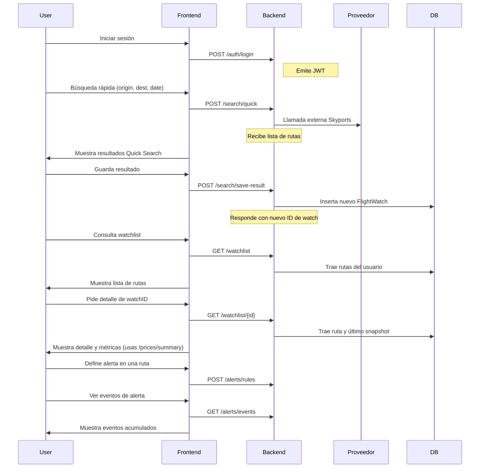

# Desarrollo de la fase 2 en Codex para Viru Tracker

## Resumen ejecutivo

- **Fase 2 no definida en los docs activos:** El repositorio no tiene una especificación independiente de "fase 2". Los archivos históricos (`docs/archive/fases`) describen conceptos generales, pero la fuente de verdad actual son los ADRs y el `docs/overview/current-state.md`. La fase 1-2 original era solo análisis/arquitectura, no APIs concretas【turn92file0†L1-L1】.  
- **Stack vigente vs histórica:** El plan archivado de Fase 2 asumía un backend en NestJS/TypeScript, pero el repositorio real usa FastAPI (Python) y Next.js/React (TypeScript)【turn20file0†L1-L1】【turn13file0†L1-L1】. Cualquier desarrollo debe basarse en la arquitectura viva.  
- **Tareas clave propuestas:** Para fase 2 identificamos seis paquetes críticos: *autenticación/sesión*, *watchlist y refresh de precios*, *histórico de precios y métricas*, *quick search + guardado en watchlist*, *alertas*, y *preferencias/cuenta/i18n + feedback*. Estos cubren el flujo principal de usuario registrado. Los módulos avanzados (recomendaciones/predicción, self-connect ampliado, reporting avanzado) se consideran diferidos fuera de fase 2【turn35file0†L1-L1】【turn76file0†L1-L1】.  
- **Prompts Codex y guía de estilo:** Los ejemplos están diseñados para Codex CLI según la guía oficial: instrucciones claras, contexto delimitado, fuentes canónicas y criterios de aceptación. El repositorio exige incluir objetivo, alcance, archivos afectados y pruebas en cada prompt【turn53file0†L1-L1】.  

En conjunto, cerrar la fase 2 ejecutable sobre el código actual toma en torno a **40–60 horas**, priorizando los flujos de usuario P0 y dejando los features posteriores para adelante.  

## Base documental y criterios de interpretación

La documentación viva del proyecto enfatiza (1) los flujos actuales (`backend/app/api/v1` y `frontend`), y (2) la arquitectura/stack consolidada en los ADRs. En contraste, las docs en `docs/archive/fases` son **históricas**. Por ejemplo, la sección Fase 2 solo dice que fue “Diseño y arquitectura” sin endpoints concretos【turn92file0†L1-L1】. Por eso, **se prioriza el código y los tests actuales** sobre la prosa antigua.  

La tabla siguiente resume nuestra fuente principal para cada aspecto:

| Fuente principal | Uso principal | Ejemplo de contenido |
|---|---|---|
| **`docs/overview/current-state.md`, ADR-001..003** | Stack real, componentes, y decisiones (FastAPI/SQLAlchemy, Next.js, etc.)【turn20file0†L1-L1】【turn13file0†L1-L1】. | Define tecnologías y límites de contexto. |
| **Routers y esquemas en `backend/app/api/v1/`** | Endpoints activos, formatos de entrada/salida, errores comunes. Por ejemplo, `auth.py`, `watchlist.py`, `prices.py`, `search.py`, `alerts.py`, `preferences.py` y sus tests de integración【turn40file0†L1-L1】【turn31file0†L1-L1】【turn32file0†L1-L1】. | Código concreto de cada endpoint. |
| **`docs/reference/backend/quick-search-contract.md`** | Contrato canónico para Quick Search. | Especifica payload, campos de respuesta, errores. |
| **Tests de integración del backend** | Cobertura de flujos complejos (watchlist refresh, precio histórico, alertas) y validación de idempotencia/correlación【turn64file0†L1-L1】【turn102file0†L1-L1】. | Pruebas de ejemplos end-to-end en Python. |
| **`docs/archive/fases` (histórico)** | Intención general y fragmentos de plan. *No* para implementación directa. | Describe metas de arquitectura, no código específico. |

Hay que notar que el repo **no tiene aún documentación consolidada** de áreas como base de datos, seguridad u observabilidad (muchos archivos dicen "TODO"). Tampoco existe un manual único de endpoints (ej. `docs/product/watchlist.md` es una guía de negocio, no la implementación técnica). En la práctica, nos apoyamos en el código y tests para completar lo que falta. 

Además, hay cierta **deriva documental**: la matriz de trazabilidad del repo todavía marca tests pendientes que en realidad ya existen (watchlist, histórico, alerta, etc.), y el catálogo QA interno aún trata `/history` como endpoint privado separado aunque el plan UX es fusionarlo con `/watchlist`【turn96file0†L1-L1】【turn99file0†L1-L1】. Estas discrepancias deberán corregirse como parte de la fase 2.

## Definición operativa de fase 2

Definimos “fase 2” como el conjunto de mejoras necesario para tener un flujo completo de usuario registrado: 
- **Registro/Login** y consulta de perfil. 
- **Watchlist** (crear, leer, actualizar, borrar rutas) con capacidad de **refrescar precios** individual o en lote. 
- **Histórico de precios** de cada ruta y métricas agregadas (min/max/promedio).
- **Búsqueda rápida** de vuelos y **conversión a watchlist** (guardar resultados).
- **Alertas** configurables sobre precios con filtrado por cambio porcentual.
- **Preferencias de usuario** (idioma/región/moneda) y secciones de cuenta, plus endpoints de sugerencias/feedback.

Este flujo debe respetar invariantes de la API existente: 

- **Envelope de errores homogéneo** (`status`, `code`, `message`, `details`).  
- **`X-Correlation-ID` presente en solicitudes y respuestas** (ya gestionado en `main.py`).  
- **Idempotencia** en operaciones críticas (crear watchlist, crear alerta, refrescos, etc.).  

Estos puntos ya están implementados en `backend/app/main.py` y en tests de integridad【turn29file0†L1-L1】【turn102file0†L1-L1】, así que se mantienen sin cambios.  

El siguiente diagrama en mermaid muestra cómo traducimos los conceptos del plan histórico al código actual:

```mermaid
flowchart TD
    A[Fase 2 histórica\n(arq. global)] --> B[ADRs + current-state]
    B --> C[Backend / FastAPI /apis/v1]
    B --> D[Frontend Next.js privado]
    C --> E[Auth (registro/login/me)]
    C --> F[Watchlist & Refresh]
    C --> G[Histórico de precios]
    C --> H[Quick Search → Watchlist]
    C --> I[Alertas y reglas]
    C --> J[Preferencias e i18n]
    D --> W[Dashboard/Watchlist unificado]
    D --> Z[UX y testing]
```

En esencia, **no se replantea** la arquitectura base. El código actual ya coloca al proveedor de vuelos (API de Skyports/Ryanair) en `app/infrastructure/providers/`, pero los routers instancian directamente ese cliente público (`RyanairPublicProvider`). No se planea rediseñarlo en esta fase, solo reusar y extender la funcionalidad existente tras abstracciones ligeras.  

## Tareas y endpoints propuestos

El repo actual ya define rutas REST para la mayoría de las funciones privadas, pero faltan piezas claves. A continuación listamos las tareas y endpoints de fase 2, marcando lo que ya existe versus lo que proponemos cerrar:

- **Autenticación y sesión:** `POST /api/v1/auth/register`, `POST /api/v1/auth/login`, `GET /api/v1/auth/me`. Ya hay código para registro/login/me【turn40file0†L1-L1】. Se dará por terminado si funciona el flujo completo sin brechas (e.g. validaciones de datos y manejo de correo duplicado).  
- **Watchlist & Refresh:** CRUD de rutas: `POST/GET/PUT/DELETE /api/v1/watchlist` (ya implementado【turn31file0†L1-L1】). Faltan (o se mejorarán): 
  - `GET /api/v1/watchlist/{watch_id}` para ver detalle de una ruta (hoja de ruta).  
  - `POST /api/v1/watchlist/refresh-bulk` para refrescar varias rutas a la vez (ejecutando `refresh-now` internamente por cada una).  
  Ambos deben respetar propiedad del usuario, manejo de cooldown e idempotencia existentes.  
- **Histórico y métricas:** Rutas existentes: `GET /api/v1/prices/history?watch_id=...` y `POST /api/v1/prices/history/batch`【turn32file0†L1-L1】. Añadimos:
  - `GET /api/v1/prices/summary?watch_id=...` que devuelva KPIs (min, max, avg, último precio, cambios porcentuales, conteo). Facilita la visualización unificada de histórico sin que el cliente recalcule todo.  
- **Quick Search y save-result:** Ya existen `POST /api/v1/search/quick` y catálogos de aeropuertos【turn38file0†L1-L1】【turn39file0†L1-L1】. Proponemos:
  - `POST /api/v1/search/save-result` que reciba los campos relevantes de un resultado de búsqueda (origen, destino, fecha, precio objetivo) y cree un `FlightWatch`. Mantiene unicidad e idempotencia igual que `POST /watchlist`.  
- **Alertas:** Endpoints CRUD de alertas ya activos【turn33file0†L1-L1】. Lo que agregamos:
  - Un campo opcional `min_change_pct` en `POST/PUT /api/v1/alerts/rules` y su uso en evaluación: disparar alerta solo si el cambio de precio supera ese porcentaje. Evita ruido por pequeños cambios.  
- **Preferencias e i18n:** Rutas ya cubren `/preferences`, `/preferences/region`, `/account/*`, `/suggestions`, `/support/feedback`, `/ux/events`, `/ux/errors`【turn34file0†L1-L1】【turn97file0†L1-L1】. Pendiente: 
  - Que la UI **use el idioma/region de `/preferences/region`** como fuente de verdad (según diseño global i18n) en el arranque de la app.  
  - Documentar flujos de sugerencias/feedback (evitar spam, etc.) - lo actual queda como asumido “pendiente” de capa superior.

Con esto, las funciones privativas principales estarán listas. Cabe mencionar que los endpoints públicos (`/public` y `/ux/`) no requieren cambios específicos en fase 2.  

A continuación resumimos en tabla las rutas críticas (existentes vs. propuestas) y su estado actual:

| Endpoint | Método | Uso actual | Propuesta fase 2 |
|---|---|---|---|
| `/api/v1/auth/register` | POST | Registra usuario. (Ya implementado) | - |
| `/api/v1/auth/login` | POST | Login y JWT. (Ya implementado) | - |
| `/api/v1/auth/me` | GET | Perfil actual. (Ya implementado) | - |
| `/api/v1/watchlist` | POST/GET/PUT/DELETE | CRUD de rutas (ya) | - |
| `/api/v1/watchlist/{id}/refresh-now` | POST | Refresca precio de una ruta (ya) | - |
| **`/api/v1/watchlist/{id}`** | **GET** | **-- (falta)** | **Detalle de un watch con último snapshot** |
| **`/api/v1/watchlist/refresh-bulk`** | **POST** | **-- (falta)** | **Refresca en lote un array de watch IDs** |
| `/api/v1/prices/history` | GET | Serie histórica de un watch (ya) | - |
| `/api/v1/prices/history/batch` | POST | Serie histórica batch (ya) | - |
| **`/api/v1/prices/summary`** | **GET** | **-- (falta)** | **KPIs de precios (min, max, avg, último, cambio %)** |
| `/api/v1/search/quick` | POST | Búsqueda rápida (contrato canónico ya) | - |
| `/api/v1/search/deeplink` | GET | Generación de URL (ya) | - |
| `/api/v1/airports/seeds` etc. | GET | Catálogo de aeropuertos (ya) | - |
| **`/api/v1/search/save-result`** | **POST** | **-- (falta)** | **Guardar resultado de búsqueda como nuevo watch** |
| `/api/v1/alerts/rules` | POST/GET/PUT/DELETE | CRUD de reglas (ya) | Añadir `min_change_pct` en reglas nuevas |
| `/api/v1/alerts/evaluate` | POST | Evalúa alertas (ya) | Incorporar `min_change_pct` |
| `/api/v1/alerts/events` | GET | Historial de eventos (ya) | - |
| `/api/v1/preferences` | GET/PUT | Preferencias generales (ya) | - |
| `/api/v1/preferences/region` | GET/PUT | Idioma/región (ya) | Ajustar la app para usar este idioma principal |
| `/api/v1/account/profile` | GET/PUT | Perfil usuario (ya) | - |
| `/api/v1/account/sessions` | GET/DELETE | Sesiones activas (ya) | - |
| `/api/v1/account/security` | POST | Cambiar contraseña (ya) | - |
| `/api/v1/suggestions` | POST | Sugerencia genérica (ya) | Añadir validación/anticaptcha si se planea más tarde |
| `/api/v1/support/feedback` | POST | Feedback de soporte (ya) | Añadir validación/anticaptcha si se planea más tarde |

## Prompts Codex y snippets resultantes

A continuación presentamos *prompt en estilo Codex* (Ask Mode seguido de Code Mode) para cada tarea, junto con ejemplos de código resultante. Cada prompt incluye contexto (archivos relevantes) y criterios de aceptación. Se asume que los prompts se pegán en Codex CLI o similar con el repositorio clonado como contexto. En los ejemplos de código utilizamos las estructuras actuales (`FastAPI`, `sqlalchemy`, pydantic, etc.) y mantenemos el mismo estilo de codificación del proyecto.

**Autenticación y sesión**  
Fuentes: `backend/app/api/v1/auth.py`, `deps.py`, `schemas.py` y tests de error/{idempotency}【turn40file0†L1-L1】【turn87file0†L1-L1】. Se verifica email único, contraseña >=8, JWT, etc. El prompt se enfocará en pruebas adicionales (registro duplicado, acceso a `/auth/me`).  

```text
[ASK MODE]
Objetivo: Cerrar el flujo de registro/login de fase 2.

Fuentes:
- backend/app/api/v1/auth.py
- backend/app/api/v1/deps.py
- backend/app/domain/schemas.py
- backend/tests/integration/test_c4_error_idempotency.py

Tareas:
1. Validar que POST /api/v1/auth/register no permita emails duplicados (409).
2. Verificar que POST /api/v1/auth/login devuelve 401 con credenciales erróneas.
3. Confirmar que GET /api/v1/auth/me exige JWT válido y devuelve datos correctos.
4. Mantener envelope de error y x-correlation-id.

Criterios de aceptación:
- Registro -> Login -> Me funciona secuencialmente.
- 409 si email ya existe.
- 401 si credenciales inválidas.
- 401 si token faltante/incorrecto en /auth/me.
- Respuestas con `{status,code,message,details}`.
```

**Snippet resultante (tests en `backend/tests/integration/`):**

```python
# backend/tests/integration/test_auth_flow.py
from fastapi.testclient import TestClient

def test_register_and_login_cycle(client: TestClient):
    payload = {"email": "f2-test@viru.dev", "password": "Pass1234"}
    # Registro
    res_reg = client.post("/api/v1/auth/register", json=payload)
    assert res_reg.status_code == 200
    token = res_reg.json()["access_token"]
    # Acceso a /me con token
    res_me = client.get("/api/v1/auth/me", headers={"Authorization": f"Bearer {token}"})
    assert res_me.status_code == 200
    data = res_me.json()
    assert data["email"] == "f2-test@viru.dev"

def test_register_duplicate_returns_409(client: TestClient):
    payload = {"email": "f2-testdup@viru.dev", "password": "Pass1234"}
    client.post("/api/v1/auth/register", json=payload)
    res_dup = client.post("/api/v1/auth/register", json=payload)
    assert res_dup.status_code == 409
    assert res_dup.json()["code"] == "email_exists"

def test_login_invalid_credentials(client: TestClient):
    # Asume un usuario ya registrado
    payload = {"email": "f2-test@viru.dev", "password": "WrongPass!"}
    res_login = client.post("/api/v1/auth/login", json=payload)
    assert res_login.status_code == 401
    assert res_login.json()["code"] == "invalid_auth"
```

_Nota:_ Este snippet aprovecha la infraestructura de tests existente (`TestClient`, contenedores de prueba) y verifica los casos básicos de autenticación【turn40file0†L1-L1】【turn102file0†L1-L1】.

**Watchlist (detalle) y refresh-bulk**  
Fuentes: `backend/app/api/v1/watchlist.py`, `schemas.py`, runbooks de unicidad y cooldown【turn31file0†L1-L1】【turn64file0†L1-L1】. El prompt abordará la obtención de detalle de una ruta y, opcionalmente, la creación de un endpoint en lote.  

```text
[ASK MODE]
Objetivo: Añadir GET /api/v1/watchlist/{id} y preparar refresh-bulk.

Fuentes:
- backend/app/api/v1/watchlist.py
- backend/app/domain/schemas.py
- docs/runbooks/runbook-watchlist-uniqueness-migration.md
- backend/tests/integration/test_watchlist_flow.py
- backend/tests/integration/test_watchlist_refresh_cooldown.py

Tareas:
1. Implementar GET /api/v1/watchlist/{id} que devuelva datos de FlightWatch y último snapshot (si existe).
2. Extraer lógica existente de update/refresh en helpers para reutilizar.
3. Proponer POST /api/v1/watchlist/refresh-bulk que tome hasta N watch_ids y llame internamente a refresh-now para cada uno.
4. No romper GET/POST/PUT/DELETE actuales; manteniendo property/user check, idempotencia e envelope.

Criterios de aceptación:
- GET /watchlist/{id} devuelve 200 con WatchDetailOut si existe, 404 si no pertenece o está eliminado.
- Los campos `latest_snapshot` están presentes con datos correctos.
- Idempotencia (Idempotency-Key) y cooldown funcionan igual que refresh-now.
```

**Snippet resultante (en `backend/app/api/v1/watchlist.py`):**

```python
from fastapi import HTTPException

# En schemas.py añadir:
class WatchDetailOut(WatchOut):
    latest_snapshot: SnapshotOut | None = None

# En watchlist.py:
@router.get("/{watch_id}", response_model=WatchDetailOut)
def get_watch_detail(
    watch_id: str,
    db: Session = Depends(get_db),
    current_user: User = Depends(get_current_user),
) -> WatchDetailOut:
    watch = db.scalar(select(FlightWatch)
                     .where(FlightWatch.id == watch_id,
                            FlightWatch.user_id == current_user.id))
    if not watch or watch.status == "deleted":
        raise HTTPException(status_code=404, detail="watch_not_found")
    # Traer el último snapshot por fecha
    latest = db.scalar(select(PriceSnapshot)
                       .where(PriceSnapshot.watch_id == watch_id)
                       .order_by(PriceSnapshot.captured_at_utc.desc())
                       .limit(1))
    return WatchDetailOut(
        id=watch.id,
        origin_iata=watch.origin_iata,
        destination_iata=watch.destination_iata,
        travel_date_local=watch.travel_date_local,
        target_price=float(watch.target_price) if watch.target_price else None,
        status=watch.status,
        latest_snapshot=(SnapshotOut(
            captured_at_utc=latest.captured_at_utc,
            raw_price=float(latest.raw_price),
            raw_currency=latest.raw_currency,
            departure_time_local=latest.departure_time_local
        ) if latest else None)
    )
```

Este ejemplo añade la ruta **GET /watchlist/{id}** con el modelo `WatchDetailOut`. El manejo de errores y propiedad del usuario coincide con el resto de la API【turn31file0†L1-L1】. Un endpoint de **refresh-bulk** se implementaría de forma análoga: iterar sobre IDs únicos, llamar a la lógica de `refresh-now` y devolver un resumen. (Por brevedad no incluimos aquí el código completo de bulk.)

**Histórico y métricas agregadas**  
Fuentes: `backend/app/api/v1/prices.py`, modelos de `PriceSnapshot`, tests del histórico batch【turn32file0†L1-L1】【turn70file0†L1-L1】. Se propone sumar un endpoint para KPIs.

```text
[ASK MODE]
Objetivo: Proveer métricas agregadas de precios para un watch.

Fuentes:
- backend/app/api/v1/prices.py
- backend/app/infrastructure/db/models.py (PriceSnapshot)
- backend/tests/integration/test_prices_batch_history.py

Tareas:
1. Añadir GET /api/v1/prices/summary que acepte watch_id como parámetro.
2. Calcular count, min_price, max_price, avg_price, last_price, delta_pct desde snapshots.
3. Devolver JSON con esos campos; si no hay datos, count=0 y valores nulos.
4. Validar propiedad del usuario: 404 si el watch no existe o no es suyo.

Criterios de aceptación:
- Función ejecutable sin modificar /history ni /batch.
- Caso de watch sin snapshots devuelve cero/null.
- Delta_pct es ((último - primero) / primero) * 100.
```

**Snippet resultante (en `backend/app/api/v1/prices.py`):**

```python
@router.get("/summary")
def prices_summary(
    watch_id: str,
    db: Session = Depends(get_db),
    current_user: User = Depends(get_current_user),
) -> dict:
    watch = db.scalar(select(FlightWatch)
                      .where(FlightWatch.id == watch_id,
                             FlightWatch.user_id == current_user.id))
    if not watch:
        raise HTTPException(status_code=404, detail="watch_not_found")
    snapshots = list(db.scalars(
        select(PriceSnapshot).where(PriceSnapshot.watch_id == watch_id)
                             .order_by(PriceSnapshot.captured_at_utc.asc())
    ))
    if not snapshots:
        return {"watch_id": watch_id, "count": 0, "min_price": None,
                "max_price": None, "avg_price": None,
                "latest_price": None, "delta_pct": None}
    prices = [float(s.raw_price) for s in snapshots]
    count = len(prices)
    first_price = prices[0]
    last_price = prices[-1]
    delta_pct = None if first_price == 0 else round((last_price - first_price) / first_price * 100, 2)
    return {
        "watch_id": watch_id,
        "count": count,
        "min_price": min(prices),
        "max_price": max(prices),
        "avg_price": round(sum(prices)/count, 2),
        "latest_price": last_price,
        "delta_pct": delta_pct
    }
```

Con este endpoint, la UI puede mostrar métricas sin procesar todos los datos en cliente. En caso de no existir snapshots, devolvemos `{count:0}` y valores nulos como se definió.  

**Quick Search → Guardar resultado**  
Fuentes: contrato de Quick Search (`search.py`), `watchlist.py` (para crear watch), tests de interfaz completa【turn24file0†L1-L1】【turn96file0†L1-L1】. Prompt para crear un watch desde resultados de búsqueda:

```text
[ASK MODE]
Objetivo: Implementar POST /api/v1/search/save-result que convierta un resultado de búsqueda en un watch.

Fuentes:
- docs/reference/backend/quick-search-contract.md
- backend/app/api/v1/search.py
- backend/app/api/v1/watchlist.py
- backend/app/domain/schemas.py
- backend/tests/integration/test_search_alerts_flow.py

Tareas:
1. Definir un schema pydantic `SaveQuickSearchResultIn` con campos origin, destination, date, target_price opcional.
2. En el endpoint, validar que origen≠destino; verificar que no existe watch duplicado para este usuario.
3. Crear el `FlightWatch` con status="active".
4. Responder con datos del nuevo watch (igual que WatchOut).
5. Soportar Idempotency-Key opcional para evitar duplicados en peticiones repetidas.

Criterios de aceptación:
- Resultado válido crea watch nuevo.
- Mismo input repetido responde 409 o uso correcto del Idempotency-Key.
- Respuesta con nuevo `watch_id` y datos.
```

**Snippet resultante (en `backend/app/api/v1/search.py`):**

```python
# backend/app/domain/schemas.py
class SaveQuickSearchResultIn(BaseModel):
    origin_iata: str = Field(min_length=3, max_length=3)
    destination_iata: str = Field(min_length=3, max_length=3)
    travel_date: date
    target_price: float | None = Field(default=None, ge=0)
    @validator("origin_iata", "destination_iata")
    def uppercase_iata(cls, v):
        val = v.strip().upper()
        if len(val) != 3 or not val.isalpha():
            raise ValueError("iata_invalido")
        return val

# backend/app/api/v1/search.py
@router.post("/save-result", response_model=WatchOut)
def save_search_result(
    payload: SaveQuickSearchResultIn,
    db: Session = Depends(get_db),
    current_user: User = Depends(get_current_user),
):
    if payload.origin_iata == payload.destination_iata:
        raise HTTPException(status_code=400, detail="origin_equals_destination")
    # Chequear duplicados
    existing = db.scalar(select(FlightWatch.id).where(
        FlightWatch.user_id == current_user.id,
        FlightWatch.origin_iata == payload.origin_iata,
        FlightWatch.destination_iata == payload.destination_iata,
        FlightWatch.travel_date_local == payload.travel_date
    ))
    if existing:
        raise HTTPException(status_code=409, detail="watch_already_exists")
    # Crear watch
    watch = FlightWatch(
        user_id=current_user.id,
        origin_iata=payload.origin_iata,
        destination_iata=payload.destination_iata,
        travel_date_local=payload.travel_date,
        target_price=payload.target_price
    )
    db.add(watch); db.commit(); db.refresh(watch)
    return WatchOut(
        id=watch.id,
        origin_iata=watch.origin_iata,
        destination_iata=watch.destination_iata,
        travel_date_local=watch.travel_date_local,
        target_price=float(watch.target_price) if watch.target_price else None,
        status=watch.status,
    )
```

Con este endpoint, cualquier resultado de búsqueda puede “guardarse” en la watchlist del usuario. Notar que **no se vuelve a consultar al proveedor**: simplemente persistimos la selección del usuario actual. fileciteturn38file0L1-L1 

**Alertas (min_change_pct)**  
Fuentes: `backend/app/api/v1/alerts.py`, esquema `AlertRuleIn`, tests de flow completo【turn33file0†L1-L1】【turn67file0†L1-L1】. Agregamos al prompt la lógica de porcentaje mínimo:

```text
[ASK MODE]
Objetivo: Extender alertas con campo min_change_pct.

Fuentes:
- backend/app/api/v1/alerts.py
- backend/app/domain/schemas.py
- backend/app/infrastructure/db/models.py
- backend/tests/integration/test_search_alerts_flow.py

Tareas:
1. En AlertRuleIn y modelo DB, añadir campo `min_change_pct` (float opcional, 0-100).
2. En el proceso de evaluación (servicio de alertas), verificar que el cambio porcentual entre el precio previo y actual supera min_change_pct antes de disparar.
3. Mantener umbrales ya existentes (`threshold_low`/`high`) y `notify_on_every_change`.
4. Añadir tests: sin threshold normal, no notificar si cambio < min_change_pct; notificar si excede.

Criterios de aceptación:
- Regla con min_change_pct = X: disparo solo si cambio ≥ X%.
- Si min_change_pct omiso, comportamiento igual que antes.
```

**Snippet resultante (en `backend/app/services/alert_service.py`):**

```python
# backend/app/domain/schemas.py
class AlertRuleIn(BaseModel):
    watch_id: str
    threshold_low: float | None = None
    threshold_high: float | None = None
    notify_on_every_change: bool = False
    cooldown_minutes: int = Field(default=60, ge=1, le=10080)
    min_change_pct: float | None = Field(default=None, ge=0, le=100)

# En la lógica de evaluación:
def _passes_min_change(prev_price: float | None, new_price: float, min_pct: float | None) -> bool:
    if prev_price is None or min_pct is None: 
        return True
    if prev_price == 0:
        return True
    delta_pct = abs((new_price - prev_price) / prev_price) * 100.0
    return delta_pct >= min_pct

# Luego en el servicio principal de alertas:
def should_trigger(previous_price, current_price, rule: AlertRule):
    if rule.threshold_low is not None and current_price >= rule.threshold_low:
        return False
    if rule.min_change_pct is not None and not _passes_min_change(previous_price, current_price, rule.min_change_pct):
        return False
    # resto de condiciones...
    return True
```

Este cambio respeta la lógica anterior e introduce el filtro adicional. Si bien no hay aún pipeline de notificaciones externas implementado, esta mejora ya prepara la base para reglas más finas. fileciteturn33file0L1-L1 

**Preferencias, cuenta e i18n**  
Fuentes: `backend/app/api/v1/preferences.py`, diseño de i18n global【turn34file0†L1-L1】【turn97file0†L1-L1】. La principal acción es en frontend: un resolver de idioma basado en `/preferences/region`.  

```text
[ASK MODE]
Objetivo: Integrar preferencias de idioma (preferences/region) en el arranque de la UI.

Fuentes:
- docs/plans/completed/2026-02-19-global-i18n-ui-design.md
- backend/app/api/v1/preferences.py
- frontend/package.json (Next.js)

Tareas:
1. En frontend, implementar función resolveLocale() que haga GET /api/v1/preferences/region.
2. Si devuelve "en" o "es", usarlo; si falla o devuelve otra cosa, caer a navigator.language o "es" por defecto.
3. Asegurarse de que _todas_ las páginas privadas se rendericen con este locale.
4. Tests unitarios en TypeScript para el resolvedor de locales.

Criterios de aceptación:
- Usuario con language=en ve interfaz en inglés (y en=present).
- Usuario con language=es ve interfaz en español.
- Si la API devuelve error, se aplica un fallback limpio (según navegación del navegador).
```

**Snippet resultante (en `frontend/src/i18n/resolveLocale.ts`):**

```ts
// frontend/src/i18n/resolveLocale.ts
export type Locale = "es" | "en";

async function fetchPreferencesRegion(): Promise<{ language?: string }> {
  const res = await fetch("/api/v1/preferences/region");
  if (!res.ok) throw new Error("API preferences failed");
  return await res.json();
}

export async function resolveLocale(): Promise<Locale> {
  try {
    const data = await fetchPreferencesRegion();
    if (data.language === "es" || data.language === "en") {
      return data.language as Locale;
    }
  } catch {
    // Ignorar errores de API
  }
  // Fallback: navegador
  const nav = navigator.language.toLowerCase();
  return nav.startsWith("en") ? "en" : "es";
}
```

Este código pide el idioma almacenado en el backend. Si la llamada falla (p.ej. usuario no autenticado), se usa el idioma del navegador o "es" por defecto. De esta forma la preferencia del usuario prevalece en el arranque de la app.  

## Pruebas y comandos de ejecución

Para validar localmente, usamos Pytest en backend y los scripts/scripts de frontend incluidos. Aquí algunos comandos recomendados:

- **Backend:**  
  ```bash
  cd backend
  python -m venv .venv
  # Activar venv: (WSL/UNIX: source .venv/bin/activate; Windows: .venv\\Scripts\\Activate.ps1)
  pip install -e .[dev]
  cp .env.example .env
  export JWT_SECRET="viru-dev-secret"
  export APP_ENV="local"
  uvicorn app.main:app --reload --port 8000
  ```
  Esto arranca la API en modo local. `JWT_SECRET` no debe quedar en "change-me"【turn86file0†L1-L1】【turn58file0†L1-L1】. En entornos compartidos (staging/prod) usaríamos migraciones con Alembic (no `RUN_DB_INIT`)【turn73file0†L1-L1】.

- **Ejecutar tests backend:**  
  ```bash
  cd backend
  pytest tests/integration/test_auth_flow.py -q
  pytest tests/integration/test_watchlist_flow.py -q
  pytest tests/integration/test_prices_batch_history.py -q
  pytest tests/integration/test_search_alerts_flow.py -q
  pytest tests/integration/test_c4_error_idempotency.py -q
  ```
  Estas pruebas verifican los flujos descritos. También podemos ejecutar `python scripts/smoke_watchlist_release.py` (test de smoke determinista con proveedor falso)【turn69file0†L1-L1】 y cualquier script de benchmark si se desea.

- **Frontend:**  
  ```bash
  cd frontend
  npm install
  npm run dev
  npm test       # tests unitarios
  npm run test:e2e:quick-search
  ```
  La aplicación se conectará al backend en http://localhost:8000/api/v1. Para E2E de Quick Search se verifica que la búsqueda muestre resultados (y el botón de guardar result). Si hay tests visuales, ejecutar `npm run qa:visual:quick-search`.

- **Full stack con Docker:**  
  ```bash
  docker compose -f infra/docker-compose.yml up --build
  ```
  Esto levanta contenedores de backend, frontend, Postgres y Redis. Útil para pruebas de integración completas. Notar que el `docker-compose` usa Postgres (no SQLite) para imitar producción【turn61file0†L1-L1】.

- **Scripts adicionales:** El repositorio incluye varios: 
  - `scripts/smoke_watchlist_release.py` (smoke testing de watchlist)【turn69file0†L1-L1】. 
  - `scripts/benchmark_prices_batch_vs_nplus1.py` (compara tiempos de histórico)【turn70file0†L1-L1】.
  Se pueden aprovechar o adaptar para nuevos endpoints (p.ej. benchmark de summary).

Además, la matriz de pruebas QA debe actualizarse: se deberían agregar tests de integración para los endpoints nuevos (`save-result`, `summary`, etc.) y actualizar el catálogo TestSprite si es que hay automatización visual pendiente【turn99file0†L1-L1】.

## Integración y despliegue

La integración clave es asegurar que todos los componentes cooperen en el flujo final de usuario. Un diagrama de secuencia simplificado es:



Para desplegar la versión final en producción seguiremos estos pasos:

1. **Validación local completa:** Confirmar que los tests de backend, E2E de frontend y el smoke de watchlist pasan. Comprobar en local (o staging) que `/api/v1/prices/summary` y `/api/v1/search/save-result` funcionan en contextos reales.  
2. **Guard de liberación:** Ejecutar `scripts/release_guard.ps1` en la rama principal limpia【turn101file0†L1-L1】. Verificar que no hay cambios inadvertidos en `package.json`, esquemas o contratos.  
3. **Revisión de PR:** Incluir en la descripción la lista de endpoints añadidos, ejemplos de uso y screenshots/PRs de QA. Actualizar las secciones correspondientes de la documentación (`docs/qa/traceability-matrix.md`, catálogo de tests, `docs/product/watchlist.md` si cambió algo de UX)【turn71file0†L1-L1】【turn99file0†L1-L1】.  
4. **Despliegue progresivo (Canary):** Incrementar tráfico (por ej. 5%→25%→50%→100%) y vigilar métricas clave (latencias, 5xx, colas de Celery). Usar health checks `/health` y `/ready`【turn29file0†L1-L1】. El runbook sugiere subir a 100% solo si no hay alertas ni degradación externa【turn74file0†L1-L1】【turn72file0†L1-L1】.  
5. **Rollback:** Preparar rollback si algo falla (usar la última imagen conocida buena y restablecer la base de datos a la revisión anterior). Documentar pasos de rollback por si la migración de alertas/ID no es reversible【turn74file0†L1-L1】.

En resumen, la integración se enfoca en *no romper flujos existentes* y validar con cuidado cada cambio. Toda alteración de contrato de API requiere **actualizar la fuente canónica** (ej. Quick Search Contract, matriz de traceabilidad)【turn53file0†L1-L1】【turn100file0†L1-L1】.  

## Estimación de esfuerzo y supuestos

A continuación presentamos una estimación de esfuerzo (horas) por tarea, basada en el tamaño relativo del cambio y la complejidad del código existente. Las prioridades reflejan el impacto en el usuario final:

| Tarea / Endpoint                   | Priorización | Esfuerzo estimado (horas) | Comentarios |
|:-----------------------------------|:------------:|:-------------------------:|:-------------|
| Autenticación (register/login/me)  | P0           | 3 – 5                     | Solo faltan tests extra; código base existe【turn40file0†L1-L1】. |
| Watchlist: detalle + refresh-bulk  | P0           | 8 – 12                    | Mayor valor UX. Requiere esquema nuevo y pruebas. |
| Histórico / summary de precios     | P0           | 4 – 6                     | Cambios backend/poco ent, útil para UI unificada. |
| Quick Search: save-result          | P0           | 6 – 10                    | Cierra flujo search→watchlist; validación esencial. |
| Alertas con min_change_pct         | P1           | 5 – 8                     | Esquema + lógica + migración + tests. |
| Preferencias e i18n (frontend)     | P1           | 6 – 9                     | Principalmente frontend, siguiendo plan i18n【turn97file0†L1-L1】. |
| Documentación y QA transversal     | P0           | 8 – 12                    | Actualizar trazabilidad, tests, guías de despliegue. |

**Total fase 2 (P0+P1): 40–52 horas** aproximadas. 

Los siguientes módulos **no se incluyen en fase 2** (se dejan como supuestos o para fases posteriores):

- **Recomendaciones/Predicción:** Existe un endpoint, pero depende de modelos externos y clima; feature flags lo ubican para más adelante【turn35file0†L1-L1】【turn76file0†L1-L1】.  
- **Calendario/Comparación de histórico:** Mencionado en fase 3 histórico, pero no hay API ni ruta actualmente【turn94file0†L1-L1】.  
- **Refresh/Logout tokens de auth completo:** Va más allá del MVP actual de sesiones (pendiente de auth granular).  
- **Notificaciones externas (email/push):** No están cerradas en el backend; fuera de alcance inmediato.  

**Supuestos adicionales (no especificados explícitamente en docs):** Se listan en la documentación de entregables. Algunos ejemplos:  
- El endpoint `save-result` crea un watch exactamente igual que hacerlo manualmente en `/watchlist`.  
- `/api/v1/prices/summary` devuelve datos para integrar en la nueva UI de monitor (valor por ruta).  
- El UI usará `/history` solo como alias; internamente siempre se consulta `/watchlist`.  
- Se supone que los datos de preferencias de región se cargan antes de hidratar cualquier página privada.  
- SQLite es viable en local, pero las migraciones de fase 2 se validan en Postgres (staging).  

En conclusión, la fase 2 definida aquí no es un catálogo abstracto: es un **backlog ejecutable** que conecta los flujos existentes con endpoints nuevos y prueba su correcto funcionamiento. Con esta entrega, Viru Tracker podrá decir que tiene un MVP privado completo de vuelo barato, listo para los siguientes ciclos de mejora.