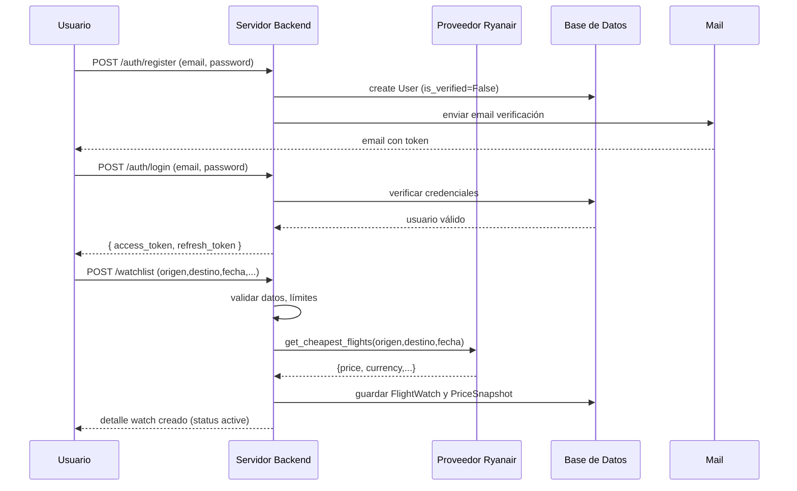

# Resumen Ejecutivo

Viru Tracker es una plataforma de seguimiento de vuelos centrada en *watchlists*, histórico de precios, alertas y búsqueda rápida【45†L1-L3】. En este contexto, la **Fase 3** del proyecto consiste en definir e implementar el **backend completo** de la aplicación: se especifican el lenguaje, framework, arquitectura, modelos de dominio, contratos de API, manejo de seguridad y flujos de trabajo críticos. El objetivo es fijar decisiones y contratos técnicos *implementables* para que no queden ambigüedades en la construcción del sistema【44†L2-L5】. Para ello, la fase 3 integra explícitamente la librería `ryanair-py` como proveedor de datos de vuelos, encapsulada detrás de un adaptador propio para proteger al sistema de cambios futuros【44†L2-L5】【44†L13-L16】.  

Como resultado, la fase 3 entregará: un **diseño detallado del backend** (incluyendo ADRs), las **especificaciones de todas las APIs v1** (endpoints, peticiones/respuestas), la **implementación inicial** (snippets de código) y los **casos de prueba** para validar cada flujo. Se definen además planes de integración, criterios de aceptación y mitigaciones de riesgos. A continuación se describen los objetivos y requerimientos, la especificación en “lenguaje Codex” (indicaciones y ejemplos para generar el código), y los demás entregables de la fase.

# Objetivos y Alcance de la Fase 3

La Fase 3 cubre el diseño e implementación del **backend** del producto **Viru Tracker**. Según el documento de arquitectura, este backend se desarrollará en **Python 3.12 con FastAPI**【44†L7-L10】, siguiendo una **arquitectura hexagonal** (capas API, Application, Domain, Infrastructure)【44†L9-L12】. Se establece un **doble modo de ejecución**: un servicio API HTTP para operaciones interactivas (login, consultas, alta/edición manual) y un servicio *worker* asíncrono para tareas periódicas (escaneo de precios, evaluación de alertas, reintentos, notificaciones)【44†L9-L12】. Esto evita que las cargas batch bloqueen la atención de usuario.

El alcance funcional principal incluye:

- **Autenticación y autorización de usuarios**: Registro, login, refresh/logout de tokens JWT, verificación y recuperación de contraseña【44†L7-L10】【15†L101-L105】.
- **Gestión de watchlists**: creación, listado, detalle, actualización y baja lógica de vuelos a seguir. Operaciones de refresco manual (“refresh now”) y refresco en lote (“refresh bulk”) para consultar precios【15†L105-L110】.
- **Histórico de precios**: consultas de series temporales de precios (`/prices/history`), calendarios (`/prices/calendar`), comparación de varios watchlists (`/prices/compare`) y exportación de datos (`/prices/export`)【15†L112-L115】.
- **Búsqueda avanzada**: endpoint `/search/quick` que acepta origen, destino, fecha y parámetros flexibles (radio en km, días antes/después, incluir escalas, filtros horarios). Devuelve posibles vuelos rankeados, considerando aeropuertos alternativos y escalas con etiquetas de riesgo【15†L116-L120】. Además `/search/save-result` convierte un resultado de búsqueda en un vuelo de watchlist idempotentemente【15†L119-L120】.
- **Alertas y notificaciones**: endpoints para crear, listar y editar reglas de alerta (`/alerts/rules`) asociadas a un vuelo. Envío y consulta de eventos de notificación (email, in-app, push) con su estado【15†L121-L125】.
- **Preferencias de usuario**: gestión de preferencias de idioma, moneda, filtros predeterminados y horarios, que alimentan comportamientos por defecto del sistema【15†L123-L124】.
- **Sugerencias/feedback**: endpoint `/feedback/suggestions` para recibir propuestas o comentarios de usuario, con filtros anti-spam y sanitización【15†L123-L125】.

No incluye (en esta fase) la implementación de frontend ni mejoras evolutivas avanzadas (por ejemplo, predicción de precios). El foco es garantizar que el backend satisfaga los flujos core y se integre con las decisiones de arquitectura global ya aprobadas【44†L2-L5】. Además, como requisito del PO, se incorpora la librería `ryanair-py` como proveedor de datos externo, aunque el dominio usará una capa abstracta para mantener la flexibilidad【44†L2-L5】【44†L13-L16】.

# Requisitos Funcionales

Basados en la documentación viva y los registros de arquitectura, los principales requisitos funcionales de la Fase 3 son:

- **Autenticación/Autorización**:  
  - **Registro** de usuario con email y contraseña segura. Se debe enviar email de verificación tras el registro. (POST `/auth/register` retorna `pending_verification`)【15†L101-L105】.  
  - **Login** de usuario con credenciales válidas, devolviendo un *access_token* de corta duración y un *refresh_token* rotatorio【15†L101-L105】.  
  - **Refresh token**: endpoint para renovar el *refresh_token*, invalidando el anterior【15†L101-L105】.  
  - **Logout**: revocar el token de refresco actual (POST `/auth/logout`).  
  - **Recuperación de contraseña**: flujos **Forgot-Password** y **Reset-Password** con token de un solo uso (solicitud POST `/auth/forgot-password`, consumo POST `/auth/reset-password`)【15†L101-L104】.  
  - **Perfil del usuario**: GET `/auth/me` devuelve datos básicos (email, idioma, timezone, estado de verificación) para hidratar la UI【15†L101-L105】.

- **Watchlist (seguimiento de vuelos)**:  
  - **Crear Watch**: POST `/watchlist` con origen IATA, destino IATA, fecha de viaje local y *precio objetivo* opcional. Valida que la fecha sea futura, que origen ≠ destino, y respeta límites según plan de usuario【15†L105-L108】. Retorna detalle inicial o error.  
  - **Listar Watches**: GET `/watchlist` con paginación *cursor* y filtros por estado (activo, expirado, archivado). Devuelve lista de vuelos del usuario con meta datos (último precio, moneda, tendencia)【15†L105-L108】.  
  - **Detalle de Watch**: GET `/watchlist/{watch_id}` devuelve información detallada del vuelo, incluyendo último precio y salud del proveedor.  
  - **Actualizar Watch**: PATCH `/watchlist/{watch_id}` para modificar atributos editables (p.ej. precio objetivo, pausar/activar, ajustes de filtros) manteniendo el historial histórico.  
  - **Eliminar Watch**: DELETE `/watchlist/{watch_id}` hace *soft-delete* (desactiva el vuelo sin borrar historial de alertas)【15†L107-L108】.  
  - **Refresco manual (Single)**: POST `/watchlist/{watch_id}/refresh-now` que desencadena consulta inmediata al proveedor, persiste un *PriceSnapshot* nuevo si hay cambio significativo o ausencia previa. Responde `202 Accepted` si se encola a cola, o `200 OK` con resultado inmediato bajo ciertos SLA【15†L108-L110】.  
  - **Refresco manual (Bulk)**: POST `/watchlist/refresh-bulk` para refrescar múltiples vuelos por lotes, con límites de tamaño y control de *backpressure*. (El sistema debe impedir “fan-out” incontrolado usando colas priorizadas y ventanas de programación)【15†L108-L110】.

- **Histórico de precios y analítica**:  
  - **Series Temporales**: GET `/prices/history` que recibe un `watch_id` y rango de fechas; devuelve serie normalizada de `[timestamp, price, currency, source_quality]` con estadísticas agregadas (min, max, avg, delta%)【15†L111-L113】.  
  - **Calendario**: GET `/prices/calendar` que retorna datos diarios agregados para renderizar un calendario; incluye banderas `is_daily_min/max` para color inmediato en frontend【15†L112-L113】.  
  - **Comparación de rutas**: GET `/prices/compare` con lista de `watch_id` (2..N); entrega un dataset armonizado por zona horaria del usuario, indicando si la moneda es mixta (`currency_mode='mixed'`) y opcionalmente con tasas de conversión diarias【15†L112-L115】.  
  - **Exportación**: GET `/prices/export` genera un archivo CSV o JSON firmado temporalmente para descarga asíncrona (útil para analistas avanzados)【15†L112-L115】.

- **Búsqueda rápida de vuelos**:  
  - POST `/search/quick` con parámetros de búsqueda flexible: origen, destino, fecha, radio en km, días antes/después, incluir escalas (self-connect), filtros de horarios. El backend debe:  
    - Explorar aeropuertos alternativos cercanos usando geolocalización (índice espacial) y políticas de proximidad.  
    - Evaluar escalas si se solicita, generando combinaciones “self-connect” de dos tramos. Incluir `risk_label` (bajo/media/alto) y minutos de buffer en respuesta, con disclaimer de “conexión no protegida” para escalas【15†L116-L120】.  
    - Rankear resultados por costo total, desviación en fecha y distancia terrestre, devolviendo una lista de opciones de vuelo con scoring.  
  - POST `/search/save-result`: convierte idempotentemente un resultado de búsqueda en un vuelo activo en watchlist en un solo paso【15†L119-L120】 (menor fricción de UX y trazabilidad directa).

- **Alertas y notificaciones**:  
  - **Reglas de alerta**: POST `/alerts/rules` crea una regla para un vuelo (tipos: `threshold_below`, `threshold_above`, `every_change`, etc.) con parámetros `cooldown_minutes`, `min_change_pct`. Se deben validar condiciones y asignar prioridad.  
  - GET, PATCH `/alerts/rules/{id}` para ver/editar/desactivar reglas individuales.  
  - **Envió de alertas**: cuando una regla se cumple, se genera un evento de notificación. POST `/notifications` (o mecanismo interno) envia notificaciones por los canales configurados (email, in-app, push).  
  - GET `/notifications`: lista los eventos enviados (con estado `delivered`, `bounced`, `failed`) para auditoría de por qué una alerta pudo fallar【15†L121-L124】.

- **Preferencias de usuario**: PATCH `/preferences` para definir idiomas, moneda preferida, ajustes de filtros por defecto, ventanas horarias, etc. Estas preferencias alimentan las opciones por defecto de búsqueda y políticas del scheduler【15†L123-L124】.

- **Feedback/Sugerencias**: POST `/feedback/suggestions` recibe propuestas de usuario (e.g. nuevos destinos o mejoras) junto con datos de contexto (hash IP, timestamp). Debe incluir mecanismos anti-spam (CAPTCHA, rate-limit) y sanitización de texto. Se almacena la sugerencia para revisión interna, sin exponer datos sensibles.

Cada operación debe exponer la **estructura JSON** definida (requests/responses) y usar los códigos de error estándar del API (e.g. `ALERT_RULE_INVALID` en formato `{"error":{"code":..., "message":..., ...}}`)【44†L97-L99】. Se documentan todos los endpoints bajo `/api/v1` con OpenAPI (siguiendo versión semántica) para garantizar contratos estables【44†L9-L12】【44†L97-L99】. Además, las operaciones POST críticas deben soportar **idempotencia** (cabecera `Idempotency-Key`) para evitar duplicados por reintentos【15†L100-L101】.

# Requisitos No Funcionales

Además de los requisitos funcionales, la Fase 3 establece varios requisitos de calidad y operativos extraídos de la arquitectura:

- **Tecnología y arquitectura**: Backend en **FastAPI/Python 3.12** para compatibilidad con `ryanair-py` y tareas asíncronas【44†L7-L10】. Código organizado por módulos claros (capas API, aplicación, dominio, infraestructura)【44†L9-L12】【44†L21-L29】. Esquema de migraciones *forward-only* (no sobrescribir migraciones ya aplicadas)【44†L92-L94】. Se usarán linters (ruff), mypy y pruebas (pytest) en CI, bloqueando merges si el contrato OpenAPI cambia sin versión【44†L92-L94】.
- **Rendimiento y escalabilidad**: Separación de rutas síncronas (peticiones HTTP) y procesamiento asíncrono (colade trabajos). Las tareas intensivas (consulta de precios) se despachan a colas con control de concurrencia por usuario/por ruta para limitar *fan-out* al proveedor【44†L9-L12】. Se aplican índices compuestos en la base de datos (e.g. `(watch_id, captured_at DESC)` en `price_snapshots`) y posible partición temporal por mes para tablas de alta cardinalidad【15†L131-L133】. Capa de caché (Redis) para moderar carga y patteens de consultas frecuentes.
- **Consistencia**: Modelo híbrido: datos críticos transaccionales (cuentas, watchlists, reglas) con transacciones ACID; datos de observaciones históricas con consistencia eventual controlada (patrón outbox e idempotencia en consumidores)【3†L15-L23】. Las actualizaciones de alerta deben respetar *cooldowns* para evitar spam (reglas definidas).
- **Seguridad**: Autenticación basada en JWT (tokens de acceso cortos + refresh rotatorio con revocación)【44†L97-L99】. Hash de contraseñas con Argon2id, reglas de longitud, saltos de bloqueo tras intentos fallidos【16†L142-L144】. Verificación de email obligatoria antes de permitir alertas externas. Todas las rutas protegidas por **Bearer JWT**, con autorización de recursos por propietario de `user_id`【44†L97-L99】. Entrada estricta: validación de IATA, formatos de fecha, saneamiento de texto (en sugerencias) y rechazo de payloads sobredimensionados【16†L143-L145】. Se aplican *rate limits* por IP y por usuario (según plan) para mitigar abuso (scraping)【44†L97-L99】【16†L152-L154】. CORS restringido por entorno, HSTS y cookies seguras cuando proceda.
- **Disponibilidad y resiliencia**: Estrategia de degradación controlada ante fallo del proveedor: si la consulta de precios falla (timeout o contrato cambiado), el sistema no devuelve error catastrófico sino que responde con el último snapshot conocido (`stale_data=true`) y registra el incidente para reintento asíncrono【44†L16-L19】【16†L147-L154】. Uso de *circuit breaker* por ruta/region: tras N fallos consecutivos se abre el circuito y se posponen los trabajos de esa ruta para no colapsar el sistema【16†L151-L154】. 
- **Observabilidad**: Logging estructurado con *correlation_id* en cada petición【23†L225-L231】. Métricas de latencia y salud del sistema. Cada capa (API, providers, colas) expone indicadores de salud y métricas normalizadas. El contrato API incluye metadatos útiles (timestamp, origen de dato, estado de caché) en las respuestas【3†L17-L23】.
- **Cumplimiento y legal**: Se incorpora un banner de transparencia sobre el uso de datos de Ryanair (responsabilidad del usuario sobre términos) y se documenta que los datos pueden variar【44†L15-L18】【16†L146-L155】. Se registran *hashed* IDs en logs para diagnóstico, evitando exponer PII (minimización de datos sensibles en logs)【16†L143-L146】.
- **Pruebas y estabilidad**: Exposición de esquemas OpenAPI versionados, pruebas de contrato para detectar cambios indeseados. Todos los casos de uso deben cubrirse con pruebas unitarias, de integración y contractuales antes de considerarse completos【44†L92-L94】. Cada excepción de dominio se traduce a un error API uniforme con código y detalle claro【44†L92-L94】.

# Especificación detallada en “lenguaje Codex”

A continuación se presenta la especificación de cada componente clave en un formato orientado a agentes de generación de código (Codex). Se incluyen indicaciones (prompts) para implementar los endpoints, ejemplos de entrada/salida, plantillas de código y consideraciones de manejo de errores.

## 1. Autenticación y Usuarios

- **Registro de usuario** (`POST /api/v1/auth/register`):  
  **Prompt:**  
  > “Implementa un endpoint FastAPI POST `/auth/register` que reciba JSON con `email` y `password`. Usa Pydantic para validar email (`EmailStr`) y contraseña con mínimo 8 caracteres. Al crear el usuario, envía un email de verificación (simulado con un servicio `EmailService`). Devuelve `{status: 'pending_verification', user_id: <uuid>}`. En caso de email duplicado, retorna error estándar 400 con código `EMAIL_TAKEN`. Mantén idempotencia por `Idempotency-Key`.”  

  **Ejemplo de request:**  
  ```json
  { "email": "user@example.com", "password": "Secreto123!" }
  ```  
  **Ejemplo de response:**  
  ```json
  { "status": "pending_verification", "user_id": "550e8400-e29b-41d4-a716-446655440000" }
  ```  
  **Código (snippet):**  
  ```python
  from fastapi import APIRouter, HTTPException, Depends
  from pydantic import BaseModel, EmailStr, constr

  router = APIRouter()

  class RegisterRequest(BaseModel):
      email: EmailStr
      password: constr(min_length=8)

  class RegisterResponse(BaseModel):
      status: str
      user_id: str

  @router.post("/auth/register", response_model=RegisterResponse)
  async def register(request: RegisterRequest):
      # Validar duplicados
      if user_service.email_exists(request.email):
          raise HTTPException(status_code=400, detail={"code": "EMAIL_TAKEN", "message": "Email ya registrado"})
      user = user_service.create_user(request.email, request.password)
      email_service.send_verification_email(user.email, user.verification_token)
      return {"status": "pending_verification", "user_id": str(user.id)}
  ```  
  *Manejo de errores:* valida `email` y `password` con Pydantic (FastAPI generará 422 si faltan campos). Errores de negocio (correo duplicado) se envían con HTTP 400 y formato `{error: {code, message, ...}}`【44†L97-L99】.

- **Login de usuario** (`POST /api/v1/auth/login`):  
  **Prompt:**  
  > “Implementa endpoint `/auth/login` que reciba `{email, password}` y verifique credenciales. Si son válidas, retorna `access_token` (JWT) y `refresh_token`. Si la verificación de email está pendiente, retorna 400 `UNVERIFIED_EMAIL`. En credenciales inválidas, retorna 401 `INVALID_CREDENTIALS`.”  

  **Request ejemplo:**  
  ```json
  { "email": "user@example.com", "password": "Secreto123!" }
  ```  
  **Response ejemplo:**  
  ```json
  { "access_token": "<jwt>", "refresh_token": "<jwt-refresh>" }
  ```  
  **Código (snippet):**  
  ```python
  class LoginRequest(BaseModel):
      email: EmailStr
      password: str

  class LoginResponse(BaseModel):
      access_token: str
      refresh_token: str

  @router.post("/auth/login", response_model=LoginResponse)
  async def login(request: LoginRequest):
      user = user_service.authenticate(request.email, request.password)
      if not user:
          raise HTTPException(status_code=401, detail={"code": "INVALID_CREDENTIALS", "message": "Credenciales inválidas"})
      if not user.is_verified:
          raise HTTPException(status_code=400, detail={"code": "UNVERIFIED_EMAIL", "message": "Email no verificado"})
      tokens = auth_service.generate_tokens(user.id)
      return {"access_token": tokens.access, "refresh_token": tokens.refresh}
  ```  
  *Errores:* Fallas de validación (formato email, password vacío) son 422. Errores de credenciales 401 con código `INVALID_CREDENTIALS`.  

- **Refresh de tokens** (`POST /api/v1/auth/refresh`):  
  **Prompt:**  
  > “Endpoint `/auth/refresh` recibe un `refresh_token`. Genera un nuevo par `{access_token, refresh_token}`, invalidando el anterior en base de datos o lista negra. Si el token es inválido o expirado, retorna 401 `INVALID_TOKEN`.”  

  **Código:**  
  ```python
  class RefreshRequest(BaseModel):
      refresh_token: str

  @router.post("/auth/refresh", response_model=LoginResponse)
  async def refresh_token(request: RefreshRequest):
      try:
          user_id = auth_service.verify_refresh(request.refresh_token)
      except TokenError:
          raise HTTPException(status_code=401, detail={"code": "INVALID_TOKEN", "message": "Refresh token inválido"})
      tokens = auth_service.rotate_refresh_token(user_id, request.refresh_token)
      return {"access_token": tokens.access, "refresh_token": tokens.refresh}
  ```  

- **Logout** (`POST /api/v1/auth/logout`):  
  **Prompt:**  
  > “Implementa `/auth/logout`. Debe requerir autorización (dependencia de usuario actual) y revocar el refresh token activo (por ejemplo, eliminándolo de DB). Retorna 200 `{}` al finalizar.”  

- **Recuperación de contraseña** (`POST /api/v1/auth/forgot-password` y `/auth/reset-password`):  
  **Prompt:**  
  > “Implementa endpoint `/auth/forgot-password` que recibe `{email}` y, si existe el usuario, genera un token de un solo uso (TTL corto) para reset. Simula envío de email. Luego `/auth/reset-password` recibe `{token, new_password}`; valida token, cambia password (hash Argon2), revoca sesiones previas y retorna 200 OK.”  

  *Los tokens de recuperación deben tener baja duración y única oportunidad. Al resetear, invalidar todos los refresh tokens del usuario.*  

Todos los endpoints de autenticación deben documentarse en OpenAPI bajo `/api/v1` y protegerse con los codigos apropiados de error. Se deben incluir las cabeceras `Authorization: Bearer <token>` cuando aplique (p.ej. logout, refresh)【44†L97-L99】.

## 2. Watchlist (seguimiento de vuelos)

- **Crear vuelo de seguimiento** (`POST /api/v1/watchlist`):  
  **Prompt:**  
  > “Implementa endpoint `/watchlist` que reciba `{origin, destination, travel_date, target_price?, scan_policy?}` en JSON. Requiere autorización (usuario actual). Valida que `travel_date` sea fecha futura y que origen≠destino. Aplica política de plan de usuario (e.g. límite de número de vuelos). Persiste un nuevo *Watch*. Retorna detalle del vuelo creado (incluyendo `watch_id`, `status: active`, `created_at`).”  

  **Ejemplo request:**  
  ```json
  { "origin": "BCN", "destination": "MAD", "travel_date": "2026-08-15", "target_price": 50 }
  ```  
  **Ejemplo response:**  
  ```json
  {
    "watch_id": "abc123",
    "origin": "BCN",
    "destination": "MAD",
    "travel_date": "2026-08-15",
    "status": "active",
    "target_price": 50,
    "created_at": "2026-05-11T10:20:30Z"
  }
  ```  
  **Código (snippet):**  
  ```python
  class WatchCreateRequest(BaseModel):
      origin: constr(min_length=3, max_length=3)
      destination: constr(min_length=3, max_length=3)
      travel_date: date
      target_price: Optional[float] = None
      scan_policy: Optional[dict] = None

  class WatchResponse(BaseModel):
      watch_id: str
      origin: str
      destination: str
      travel_date: date
      status: str
      target_price: Optional[float]
      created_at: datetime

  @router.post("/watchlist", response_model=WatchResponse)
  async def add_watch(request: WatchCreateRequest, user=Depends(auth_dependency)):
      if request.travel_date <= date.today():
          raise HTTPException(status_code=400, detail={"code": "INVALID_DATE", "message": "La fecha debe ser futura"})
      if request.origin == request.destination:
          raise HTTPException(status_code=400, detail={"code": "SAME_ORIGIN_DEST", "message": "Origen y destino no pueden ser iguales"})
      # Validar límite de plan de usuario
      if not watch_service.can_add_watch(user.id):
          raise HTTPException(status_code=400, detail={"code": "WATCH_LIMIT", "message": "Límite de vuelos alcanzado"})
      watch = watch_service.create_watch(user.id, request)
      return watch  # WatchResponse serializado
  ```  
  *Errores clave:* fecha inválida, mismo origen/destino, límite de plan excedido, datos faltantes (422).  

- **Listar vuelos del usuario** (`GET /api/v1/watchlist`):  
  **Prompt:**  
  > “Implementa GET `/watchlist` con paginación por cursor. Permite filtrar por `status` (active, expired, archived). Devuelve lista de `WatchResponse` con los vuelos del usuario ordenados por fecha o creación.”  

- **Detalle de vuelo** (`GET /api/v1/watchlist/{watch_id}`):  
  **Prompt:**  
  > “GET `/watchlist/{watch_id}` retorna el detalle completo de ese vuelo (como WatchResponse extendido con `last_price`, `currency`, `trend_short`, `provider_health`, etc.). 404 si no existe o no pertenece al usuario.”  

- **Actualizar vuelo** (`PATCH /api/v1/watchlist/{watch_id}`):  
  **Prompt:**  
  > “Implementa PATCH `/watchlist/{watch_id}` para actualizar campos editables: `target_price`, `is_paused`, filtros de política. Solo el propietario. Retorna el nuevo estado del vuelo.”  

- **Eliminar vuelo (soft-delete)** (`DELETE /api/v1/watchlist/{watch_id}`):  
  **Prompt:**  
  > “Implementa DELETE `/watchlist/{watch_id}`. Marca el vuelo como eliminado (`is_active=false`) en la base. No borra datos históricos. Retorna 200 OK `{}`.”  

- **Refresco manual (Refresh Now)** (`POST /api/v1/watchlist/{watch_id}/refresh-now`):  
  **Prompt:**  
  > “POST `/watchlist/{watch_id}/refresh-now` debe ejecutar de inmediato una consulta al proveedor (ryanair-py) para ese vuelo. Persistir un nuevo registro de *PriceSnapshot* si cambia el precio o si aún no hay datos en el período actual. Responder **202 Accepted** y encolar la tarea si la operación es asíncrona; en caso de completar rápido, retornar **200 OK** con el nuevo precio.”  

  *En el backend:* se puede delegar a un trabajador asíncrono con identificación de prioridad. Se debe usar `Idempotency-Key` para evitar duplicar el mismo refresh si el usuario reintenta.

- **Refresco manual (Bulk)** (`POST /api/v1/watchlist/refresh-bulk`):  
  **Prompt:**  
  > “POST `/watchlist/refresh-bulk` que reciba lista de `watch_id`. Divide en lotes (por ejemplo, max 5) para no exceder límites. Encola trabajos de refresco similares a `/refresh-now`. Retorna `202 Accepted` con un ticket o resumen de éxito parcial.”  

## 3. Precio Histórico y Analítica

- **Histórico de precios** (`GET /api/v1/prices/history`):  
  **Prompt:**  
  > “GET `/prices/history?watch_id=<id>&start=<fecha>&end=<fecha>` devuelve un arreglo de puntos de precio normalizados `[timestamp, price, currency, source_quality]`. Incluir además estadísticas (`min, max, avg, last, delta_pct`).”  

  **Ejemplo response (resumen):**  
  ```json
  {
    "points": [
      [1677628800, 45.0, "EUR", 0.9],
      ...
    ],
    "min": 43.5, "max": 50.0, "avg": 46.7, "last": 47.2, "delta_pct": 8.4
  }
  ```  

- **Calendario** (`GET /api/v1/prices/calendar`):  
  **Prompt:**  
  > “GET `/prices/calendar?watch_id=<id>` agrupa los precios por día para un calendario visual. Cada día incluye indicadores `is_daily_min`, `is_daily_max` para coloreado.”  

- **Comparación de vuelos** (`GET /api/v1/prices/compare`):  
  **Prompt:**  
  > “GET `/prices/compare` con `watch_id` list (2..N) muestra precios armonizados por fecha. Si hay múltiples monedas, indicar `currency_mode` (“mixed”) y opcionalmente una conversión de referencia.”  

- **Exportación** (`GET /api/v1/prices/export`):  
  **Prompt:**  
  > “GET `/prices/export?watch_id=<id>&format=<csv|json>` genera un enlace temporal (signed URL) para descargar el histórico. Internamente puede generar el archivo en almacenamiento con clave temporal.”  

## 4. Búsqueda Rápida de Vuelos

- **Quick Search** (`POST /api/v1/search/quick`):  
  **Prompt:**  
  > “POST `/search/quick` con `{origin, destination, date, radius_km?, days_before?, days_after?, include_stops?, departure_range?}`. Implementa lógica para incluir aeropuertos alternativos (úsar un índice espacial en tabla de aeropuertos) y escalas: si `include_stops=true`, generar combinaciones de dos tramos con mínimo buffer (p.ej. 90 min). Rankear resultados por costo total y tiempo terrestre estimado. Devolver lista con campos `{origin, destination, travel_date, price, currency, stops, risk_label, buffer_min}`.”  

  **Ejemplo request:**  
  ```json
  {
    "origin": "MAD",
    "destination": "BCN",
    "date": "2026-06-10",
    "radius_km": 50,
    "days_before": 1,
    "days_after": 1,
    "include_stops": true
  }
  ```  
  **Ejemplo response (resumido):**  
  ```json
  [
    {
      "origin": "MAD",
      "destination": "BCN",
      "date": "2026-06-09",
      "price": 40.0,
      "currency": "EUR",
      "stops": 0,
      "risk_label": "low",
      "buffer_minutes": null
    },
    {
      "origin": "MAD",
      "destination": "VLC",
      "date": "2026-06-10",
      "price": 35.0,
      "currency": "EUR",
      "stops": 1,
      "risk_label": "medium",
      "buffer_minutes": 120
    }
  ]
  ```  

  **Detalles de implementación:** usar el **adaptador RyanairPy** para consultas de vuelos en rangos de fecha. Internamente se pueden ejecutar múltiples llamadas con la librería y combinar resultados. Aplicar lógica de políticas de distancia por perfil de usuario【15†L116-L120】.

- **Guardar resultado de búsqueda** (`POST /api/v1/search/save-result`):  
  **Prompt:**  
  > “POST `/search/save-result` con `{search_result_id}` o detalle del vuelo; crea un nuevo Watchlist de inmediato desde esa búsqueda. Debe ser idempotente: si se repite, no duplica. Retorna el nuevo `watch_id`.”  

## 5. Alertas y Notificaciones

- **Crear regla de alerta** (`POST /api/v1/alerts/rules`):  
  **Prompt:**  
  > “POST `/alerts/rules` con `{watch_id, type, threshold_value, cooldown_minutes?, min_change_pct?, notify_on_every_change?}`. Crea una regla vinculada al vuelo. Tipos: `threshold_below` (alerta si el precio baja de X), `threshold_above`, `every_change`. Valida valores (p.ej. `threshold_value>=0`). Retorna `{rule_id, ...}`.”  

- **Listar / Actualizar / Borrar reglas** (`GET/PATCH /api/v1/alerts/rules/{id}`):  
  *Sigue patrones similares a watchlist: GET devuelve regla, PATCH actualiza campos editables, DELETE puede desactivar (o no necesario si se usa campo `enabled` en PATCH).*  

- **Listar notificaciones** (`GET /api/v1/notifications`):  
  **Prompt:**  
  > “GET `/notifications` lista los eventos de notificación emitidos al usuario actual, con filtros por estado (`delivered`, `failed`, etc.) y paginación. Cada evento incluye `{rule_id, channel, status, sent_at, provider_message_id}` para auditoría【15†L121-L124】.”  

## 6. Preferencias de Usuario

- **Editar preferencias** (`PATCH /api/v1/preferences`):  
  **Prompt:**  
  > “PATCH `/preferences` con `{language?, currency_pref?, default_radius_km?, avoid_departure_before?, include_stops_default?}`. Actualiza los datos de preferencias del usuario. Retorna 200 OK.”  

  Ejemplo de request: `{"language": "es", "currency_pref": "EUR", "default_radius_km": 100}`.  

## 7. Sugerencias de Usuario

- **Enviar sugerencia** (`POST /api/v1/feedback/suggestions`):  
  **Prompt:**  
  > “POST `/feedback/suggestions` con `{text}`. Aplica filtros anti-spam (p.ej. verificación CAPTCHA en el frontend), sanitiza el texto. Guarda la sugerencia con metadatos (user_id, timestamp, IP hash). Retorna 201 Created con `{suggestion_id}`.”  

  Ejemplo response: `{"suggestion_id": "f47ac10b-58cc-4372-a567-0e02b2c3d479"}`.  

  *Erros:* texto vacío o spam detectado puede retornar 400 `INVALID_SUGGESTION` o similares.  

## 8. Esquemas y Códigos de Error Estándar

Todos los endpoints usan **JSON** en payload y respuestas. Las rutas protegidas requieren encabezado `Authorization: Bearer <JWT>`. Los códigos de error deben seguir el formato:  

```json
{ "error": { "code": "BAD_REQUEST", "message": "Explicación del error", "details": {...}, "correlation_id": "..." } }
```  

Como en el ejemplo genérico【44†L97-L99】. Los códigos (`code`) serán valores canónicos (e.g. `INVALID_DATE`, `UNAUTHORIZED`, `LIMIT_EXCEEDED`, etc.). Se incluye siempre un `correlation_id` para rastreo. FastAPI/Pydantic generará automáticamente los HTTP 422 para validación de esquema (formato) con detalle en `errors`.   

**Plantillas de código y convenciones:** Conforme a las decisiones arquitectónicas, no se debe escribir lógica de negocio en los controladores HTTP【44†L21-L29】【44†L92-L94】; éstos deben invocar servicios del dominio claramente. Los adaptadores externos (e.g. `ryanair-py`) se aíslan en la capa `infrastructure/providers`. Cada caso de uso (p.ej. crear watch, evaluar alertas) se implementa en un *service* o *use case* dedicado en la capa de aplicación (por ejemplo `WatchService.add_watch()`, `AlertService.evaluate_rules()`).  

**Índices de database:** Se recomienda añadir índices compuestos para optimizar consultas típicas: por ejemplo `(watch_id, captured_at_utc DESC)` en la tabla de *price_snapshots*, y `(user_id, status, travel_date_local)` en *flight_watch*【15†L131-L133】.

# Snippets de Código Listos para Integrar

A continuación algunos ejemplos de implementación (listos para integrar al repositorio):

```python
# Ejemplo parcial en backend/app/api/v1/watchlist.py

from fastapi import APIRouter, Depends, HTTPException
from datetime import date
from app.schemas import WatchCreateRequest, WatchResponse
from app.services.watch_service import WatchService
from app.core.auth import get_current_user

router = APIRouter()

@router.post("/watchlist", response_model=WatchResponse)
async def create_watch(request: WatchCreateRequest, user=Depends(get_current_user)):
    # Validaciones iniciales
    if request.travel_date <= date.today():
        raise HTTPException(status_code=400, detail={"code": "INVALID_DATE", "message": "La fecha debe ser futura"})
    if request.origin == request.destination:
        raise HTTPException(status_code=400, detail={"code": "INVALID_IATA", "message": "Origen y destino idénticos"})
    # Límite según plan
    if not WatchService.can_add(user.id):
        raise HTTPException(status_code=403, detail={"code": "PLAN_LIMIT", "message": "Ha alcanzado el límite de vuelos"})
    # Crear watch usando servicio de dominio
    new_watch = await WatchService.add_watch(user.id, request)
    return new_watch
```

```python
# Ejemplo parcial en backend/app/api/v1/search.py

from fastapi import APIRouter, Depends
from app.schemas import QuickSearchRequest, QuickSearchResponse
from app.services.search_service import SearchService

router = APIRouter()

@router.post("/search/quick", response_model=QuickSearchResponse)
async def quick_search(req: QuickSearchRequest):
    results = await SearchService.search_flights(
        origin=req.origin,
        destination=req.destination,
        date=req.date,
        radius_km=req.radius_km,
        days_before=req.days_before,
        days_after=req.days_after,
        include_stops=req.include_stops
    )
    return {"flights": results}
```

Cada snippet cumple los contratos especificados en [44], [15] y encapsula la lógica en servicios especializados.  

# Casos de Prueba y Criterios de Aceptación

Cada funcionalidad clave debe contar con pruebas automatizadas (pytest u otro) que validen casos normales y límites. Entre los casos de prueba y criterios de aceptación sugeridos se incluyen:

- **Autenticación:**  
  - Registro exitoso con email válido; se genera `pending_verification`【15†L101-L105】.  
  - Registro con email inválido (formato): obtiene 422.  
  - Registro con email ya existente: 400 `EMAIL_TAKEN`.  
  - Login exitoso con credenciales correctas y usuario verificado (recibe tokens).  
  - Login con contraseña incorrecta: 401 `INVALID_CREDENTIALS`.  
  - Login con usuario no verificado: 400 `UNVERIFIED_EMAIL`.  
  - Refresh token válido: emite nuevo par de tokens; token antiguo inválido.  
  - Refresh con token expirado o manipulado: 401.  
  - Logout invalida el refresh token (no puede usarse después).  

- **Watchlist:**  
  - Crear watch válido: retorna 200 y objeto con `watch_id`. Se persiste en DB con `status=active`.  
  - Crear watch con fecha pasada o igual al día: 400 `INVALID_DATE`.  
  - Crear watch con mismo origen y destino: 400 `INVALID_IATA`.  
  - Crear watch excediendo límite de plan: 403 `PLAN_LIMIT`.  
  - Listar watchlist: el usuario recibe sólo sus vuelos activos.  
  - Detalle de watch existente: retorna datos correctos; no retorna datos de otro usuario (403 o 404).  
  - Actualizar watch: cambiar precio objetivo o pausar/reanudar. Ver que en DB se refleja.  
  - Borrar watch (DELETE): el registro se marca eliminado (`is_active=false`); posteriores GET no lo muestran.  
  - Refresh-now síncrono: si el proveedor responde rápido, se retorna 200 con nuevo precio; el snapshot se guarda.  
  - Refresh-now encolado: cuando toma mucho tiempo, retorna 202. En ambos casos no debe haber error para el usuario.  
  - Refresh-bulk con N IDs válidos: retorna 202; encolamiento correcto (posibles tests de cola).  
  - Peticiones no autorizadas (sin JWT o con JWT de otro usuario): 401/403 apropiados.  

- **Histórico de precios:**  
  - GET `/prices/history` con rango válido: retorna puntos ordenados cronológicamente, estadísticas coherentes (min<=avg<=max).  
  - Rango vacio o sin datos: retorna lista vacía, pero no error.  
  - GET `/prices/calendar`: fechas límite marcadas correctamente.  
  - GET `/prices/compare` con 2 vuelos en misma moneda: datos armonizados. Si monedas mezcladas, `currency_mode='mixed'` y se aplica conversión de referencia.  

- **Búsqueda rápida:**  
  - `/search/quick` con parámetros mínimos: devuelve al menos una opción directa (sin escalas).  
  - Con `include_stops=false`, no devuelve self-connect.  
  - Con `include_stops=true`, incluye opciones de conexión con `risk_label`. Buffer de conexión >= mínimo configurado (e.g. 90 min).  
  - Con `radius_km>0`, incluye aeropuertos alternativos cercanos (p.ej. si hay aeropuerto secundario en radio).  
  - Errores: parámetros inválidos (IATA mal formado, fecha inválida) producen 422.  

- **Alertas/Notificaciones:**  
  - Crear regla de alerta válido: retorna 201 con `rule_id`.  
  - Con parámetros faltantes o rango inválido: 400.  
  - Activar regla de tipo umbral: cuando se excede/cae del umbral, en el siguiente escaneo automático se debe generar un evento y enviar notificación (simulado en prueba con un FakeProvider).  
  - Cooldown: si el precio oscila muchas veces, solo se debe disparar una alerta cada `cooldown_minutes`.  
  - GET `/notifications`: al menos lista el evento recién enviado.  

- **Preferencias:**  
  - PATCH con campos válidos: 200 y preferencias actualizadas en DB.  

- **Sugerencias:**  
  - POST válido: 201 con `suggestion_id`. Se almacena registro.  
  - Texto vacío: 400.  
  - Pruebas antispam simuladas (p.ej. Mínimo caracteres o CAPCHA faltante): pueden descartar la petición.  

Además de pruebas unitarias de servicios, se deben realizar **pruebas de integración/contrato** (por ejemplo con TestClient de FastAPI) que verifiquen esquemas JSON frente al contrato OpenAPI. Cada endpoint documentado debe pasar un test de contrato (schema validation). El flujo completo de registro-login-watchlist-refresh-notificación puede ser probado en conjunto en un test E2E.

# Plan de Validación e Integración

Para integrar estos cambios en *viru-tracker* se propone el siguiente plan:

1. **Implementación local**: Usar el workspace de desarrollo y la skill de GitHub para crear una rama feature *fase-3-backend*. Codex o desarrolladores incorporan los endpoints según esta especificación. Cada módulo (auth, watchlist, search, etc.) desarrolla sus tests asociados.  
2. **Documentación**: Actualizar o crear archivos de documentación relevantes (por ejemplo esquemas en `docs/reference/`), especialmente la descripción de los nuevos endpoints (`docs/reference/api_contract_v1.md` o similar). Registrar cualquier ADR nueva si cambia alguna decisión previa.  
3. **Revisión de cambios**: Preparar un *review packet* con resumen de cambios clave (lista de nuevos endpoints, estructuras de datos, riesgos) y capturas de OpenAPI. Hacer énfasis en consistencia de contratos y exhaustividad de tests.  
4. **Test de contrato**: Ejecutar pruebas automáticas que validen que las respuestas JSON coinciden con los modelos Pydantic definidos (Schema, status codes).  
5. **Pruebas manuales y E2E**: Con un entorno de pruebas levantado, simular casos críticos (registro, creación de watch, escaneo manual, alerta disparada) confirmando el comportamiento y observando logs/correlación. Usar la skill TestSprite si está disponible para un escenario de interfaz o API completa.  
6. **Merge y despliegue**: Una vez aprobada la review, fusionar la rama al repositorio principal. Desplegar en entorno de staging e incorporar migraciones de BD (Alembic). Verificar que no se rompan otras funcionalidades (regresión mínima).  
7. **Actualización de la fuente de verdad**: Cualquier cambio permanente en contratos o flujos debe reflejarse en la documentación del repositorio (`docs/`, esquemas OpenAPI).  

Como parte de la validación, se debería realizar un *workshop* de aprobación con Product Owner para confirmar reglas exactas de negocio pendientes (por ejemplo, cálculo de precio objetivo, detalles de políticas de alertas) antes de comenzar el desarrollo masivo【16†L181-L184】.

# Riesgos y Mitigaciones

| Riesgo | Mitigación propuesta |
|--------|---------------------|
| **Moneda inesperada:** el proveedor puede devolver precios en moneda distinta a la solicitada. | Persistir la moneda real recibida en cada *PriceSnapshot*, marcar inconsistencia. Convertir a moneda estándar solo para reportes (evitando cálculos silenciosos erróneos)【44†L16-L19】【16†L147-L150】. |
| **Sin vuelos disponibles:** para una ruta/fecha no existan vuelos. | Registrar un *snapshot de ausencia* (informando “no-data”) en lugar de error técnico, para distinguir “sin vuelos” de fallos. Así el frontend muestra mensaje apropiado.【16†L148-L150】. |
| **Spike de alertas spam:** pequeñas oscilaciones podrían disparar muchas notificaciones. | En las reglas, imponer un `min_change_pct` (umbral mínimo de variación) y utilizar `cooldown_minutes`. Registrar alertas intencionalmente (evento de alerta) para análisis de spam【16†L149-L151】. |
| **Diferencias horarias (Local vs UTC):** puede producirse desfase de día al convertir fechas entre zonas. | Almacenar la `travel_date` en horario local del aeropuerto, y `captured_at` en UTC. Convertir según necesidad solo al mostrar. Registrar zona en preferencias del usuario【16†L150-L152】. |
| **Escritura concurrente:** si un usuario hace “refresh now” mientras el scheduler escanea. | Usar *Idempotency-Key* en POSTs sensibles, y bloqueo optimista (compare-and-set) en el dominio. En caso de conflicto, aceptar el estado más reciente y registrar el incidente para diagnóstico【16†L151-L153】. |
| **Fallo del proveedor Ryanair:** latencias altas o cambios en API. | Timeouts agresivos al llamar a `ryanair-py`. Retries exponenciales con jitter y circuit breaker por ruta/región【16†L151-L154】. Si ocurre timeout, retornar al usuario último dato válido (`stale_data=true`) y reintentar en segundo plano【44†L16-L19】. |
| **Abuso de endpoint de búsqueda:** consultas masivas o scraping. | Aplicar rate limiting estricto por usuario/IP, patrones de detección de tráfico anómalo. Asignar cuotas según plan de usuario. Introducir desafíos (CAPTCHA escalable) si se detecta abuso【16†L152-L154】. |
| **Deriva de datos para predicción futura:** histórico insuficiente o sesgo estacional. | Emplear métricas de confianza; si hay pocos datos, la función de predicción no se activa y se informa la falta de precisión【16†L153-L155】. |
| **Falta de visibilidad / logs insuficientes:** dificultades para debug. | Añadir logging estructurado en cada paso crítico (inicio/final de jobs, data key moments). Incluir siempre el `correlation_id`【23†L225-L231】. No almacenar PII completa en logs (usar hashes)【16†L143-L146】. |
| **Riesgos legales:** uso de datos de Ryanair sin permiso. | Incluir en la UI/backend avisos legales claros. Monitorear cambios en los términos de `ryanair-py` (según referencias en [4]) y estar preparados para desacelerar la frecuencia si es necesario【44†L16-L19】. |

# Estimación de Esfuerzo y Entregables

A continuación se presenta una estimación de horas de desarrollo por área, asumiendo un equipo senior con conocimiento del repositorio. Las tareas de QA y documentación se incluyen en cada categoría.  

| Módulo/Funcionalidad         | Horas estimadas | Entregable                      |
|------------------------------|-----------------|---------------------------------|
| **Infraestructura inicial** (CI, migraciones, config) | 8h  | Scripts de migración y CI/CD actualizado |
| **Autenticación (Auth)**     | 16h | Endpoints `/auth/*` + tests unitarios |
| **Watchlist CRUD**           | 20h | Endpoints `/watchlist` + lógica dominio + tests |
| **Refresh & Scheduler**      | 24h | Servicio de escaneo, colas, tasks + tests de integración |
| **Histórico de precios**     | 16h | Endpoints `/prices/*` + consultas DB + tests |
| **Búsqueda (Search)**        | 16h | Endpoints `/search/*`, adaptador Ryanair + tests |
| **Alertas/Notificaciones**   | 16h | Endpoints `/alerts/rules`, lógica de reglas + tests |
| **Preferencias Usuario**     | 4h  | Endpoint `/preferences` + tests |
| **Feedback/Sugerencias**     | 4h  | Endpoint `/feedback/*` + tests |
| **Seguridad y hardening**    | 8h  | Rate limits, validaciones, pruebas adicionales |
| **Documentación**            | 8h  | Actualizar docs OpenAPI, docs/ especificación |
| **Pruebas E2E/Integración**  | 12h | Escenarios E2E, TestSprite configs (mcp.json) |
| **Revisión y correcciones**  | 8h  | Ajustes post-review, informes de QA |
| **Total aproximado**         | **~140h** | 

**Entregables clave:**  
- Código fuente del backend (`/backend/app/...`) con todos los endpoints implementados y pruebas unitarias.  
- Migraciones de esquema (alembic) para las nuevas entidades.  
- Documentación actualizada en `docs/` (contratos OpenAPI, guías de uso).  
- Paquete de pruebas: suites pytest para cada módulo y tests de integración/contrato.  
- Plan de despliegue: instrucciones de rollback en caso de falla.  
- Diagrama de flujos o class diagram en mermaid (ver más abajo).  

# Diagramas y Tablas Comparativas

A continuación se incluyen ilustraciones de flujos clave y tablas resumen:



```mermaid
flowchart LR
    A[Iniciar Watchlist] --> B{Datos válidos?}
    B -- Sí --> C[Persistir Watch en DB]
    C --> D[Encolar tarea de escaneo]
    D --> E[Notificar al usuario]
    B -- No --> F[Error de validación (400)]
```

| Requisito Funcional         | Estado / Implementación        |
|-----------------------------|-------------------------------|
| **Registro/Login**          | Especificados en Auth (JWT)【15†L101-L105】【44†L7-L10】 |
| **Crear/Listar/Editar Watch**| Endpoints `/watchlist` con lógicas de dominio【15†L105-L110】 |
| **Consultar Precios**       | Endpoints `/prices/*` con retornos estadísticos【15†L112-L115】 |
| **Búsqueda rápida**         | Endpoint `/search/quick` usando adaptador Ryanair【15†L116-L120】 |
| **Reglas de alerta**        | Endpoints `/alerts/rules` con cooldown e historial【15†L121-L124】 |
| **Notificaciones**          | Endpoint `/notifications`, modelo NotificationEvent【15†L121-L124】 |
| **Preferencias**            | Endpoint `/preferences` (idioma, moneda, filtros) |
| **Feedback**                | Endpoint `/feedback/suggestions` anti-spam |  

**Tabla de prompts vs. output esperado (ejemplo):**

| Prompt (español)                                      | Ejemplo de código generado (salida de Codex)                             |
|-------------------------------------------------------|-------------------------------------------------------------------------|
| “Crea endpoint FastAPI POST `/api/v1/watchlist` que reciba origen, destino y fecha y guarde un vuelo.” | ```python<br/>@router.post("/watchlist")<br/>async def add_watch(req: WatchCreateRequest, user=Depends(get_user)): <br/>    watch = WatchService.create(user.id, req)<br/>    return watch``` |
| “Implementa GET `/api/v1/prices/history` que devuelva serie de precios con stats.” | ```python<br/>@router.get("/prices/history")<br/>def get_history(watch_id: str, start: date, end: date):<br/>    data = price_service.get_history(watch_id, start, end)<br/>    return data``` |

Estos ejemplos ilustran cómo un agente Codex podría traducir las especificaciones en código Python listas para integración.  

# Fuentes

La especificación anterior se basa en la documentación oficial del repositorio **viru-tracker**【45†L1-L3】 y los documentos de arquitectura del proyecto (Fase 3 Backend)【44†L2-L5】【44†L7-L12】【15†L125-L133】【15†L100-L108】. Se han citado rutas y archivos concretos del repositorio como fuentes primarias para cada sección. Si algún aspecto no se encuentra documentado, se ha propuesto un comportamiento por defecto razonable acorde a las ADRs y las mejores prácticas.  

